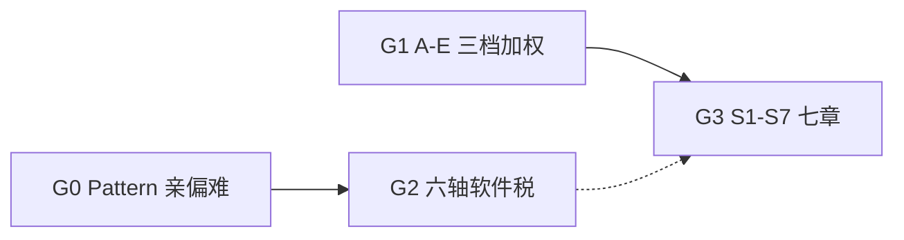

# 度量框架审计

对象：仓库内可获取的硬件易用性 / 调试调优度量文档（G0–G3）。  
方法：对照结构、复算权重、核对编号与红线单位、标出不可复现处。  
不在范围内：问卷式易用性、把 FLOPS/功耗当易用性、未入库的 xlsx / 外部「易用性度量.md」。

---

## 1. 材料与演进



| | G0 | G1 | G2 | G3 |
|---|---|---|---|---|
| 主问题 | 算子好不好写 | 各性能档好不好用 | 必须多付多少软件税 | 芯片栈好不好用 |
| 切分 | Pattern 01–29 | A/B/C/D/E | 9 税种 × 6 观测层 | S1–S7，38 个 `Sx-Dy` |
| 分数 | 2 / 1 / 0 | 100 / 80 / 60 / 0 分段 | 计数与 Δ，无等级 | 同 G1 分段，七列 $\Omega$ |
| 红线 | 无 | $\min(U_p,59)$ | S-PairGap=0 等合格线 | $U_p^{*}=0$ |
| 可复现性 | 低（专家档） | 中（有公式，表对不上） | 高（有 INCLUDE/EXCLUDE） | 中（有权重，缺计数规则） |
| 仓库状态 | `main` | `main` 全文 | PR #12 draft | PR #13 draft |

G1 自称把原 7 顶层分类收成 5 维；G3 又把画像切回 7 章。G3 的七章**不是** G1 五维的一一改名，见 §5。

---

## 2. G1 审计（`docs/下一代调试调优度量体系.md`）

这是 `main` 上唯一完整的度量体系正文：三层（度量项 / 方案 / 指标）、五维基础权重、三档 $\alpha_{p,d}$、四锚点归一化、红线、Benchmark 流程。

### 2.1 档位权重：公式与表不一致

正文：

$$
\Omega_{p,d}=\frac{\alpha_{p,d}\cdot\Omega_d}{\sum_{d'}\alpha_{p,d'}\cdot\Omega_{d'}}
$$

$\Omega=(A:0.32,B:0.25,C:0.13,D:0.12,E:0.18)$，和为 1。  
$\alpha_{60}=(0.5,0.5,1.0,0.5,0.5)$，$\alpha_{90}=(1.5,1.5,1.0,1.0,1.0)$，$\alpha_{99}=(2.0,1.5,1.5,1.5,2.0)$。

按公式复算 vs §1.3 表：

| $p$ | 来源 | A | B | C | D | E | $\sum$ |
|---|---|---|---|---|---|---|---|
| 60% | 公式 | 0.283 | 0.221 | 0.230 | 0.106 | 0.159 | 1.000 |
| 60% | 表 | 0.182 | 0.227 | 0.136 | 0.068 | 0.182 | **0.795** |
| 90% | 公式 | 0.374 | 0.292 | 0.101 | 0.093 | 0.140 | 1.000 |
| 90% | 表 | 0.367 | 0.286 | 0.094 | 0.080 | 0.137 | **0.964** |
| 99% | 公式 | 0.366 | 0.214 | 0.111 | 0.103 | 0.206 | 1.000 |
| 99% | 表 | 0.342 | 0.213 | 0.139 | 0.108 | 0.197 | 0.999 |

60% 表内五项加不满 1，用这张表算 $U_{60\%}$ 会系统性偏低约 20%。90% 也缺约 0.036。  
§4.2 又把 60% 表系数写进 $U_{60\%}=0.182S_A+\cdots$ 的展开式，错误被复制进聚合公式。

**工程含义**：在修好表之前，任何「60% 档短板是 B（22.7%）」的叙述都不可用。按公式，60% 档权重最高的是 **A（0.283）和 C（0.230）**，不是 B。

### 2.2 维度 A：项数、权重、重复定义

| 声称 | 实际 |
|---|---|
| 18 个度量项，$\sum W_{A,j}=1$ | §7 列出 **16** 个名字，权重和 **0.86** |
| A1–A7 已展开 | 七项权重和 0.56 |
| 「其余项」在 §3.1 注记 8 个 | 与 A1–A7 合计 **15** 项、权重和 **0.81** |

重复：

- A5 已含「设备初始化代码行」，其余项又单列「设备初始化 0.02」。
- A6 已含「ID 残留对消」，其余项又单列 0.02。
- A7 指标已含自动同步 / 自动 tiling / 自动格式转换，§7 又把这三项（外加「自动同步消除率 0.05」）当成独立度量项。

在权重未闭合时，$S_A$ 不是 $[0,100]$ 上的凸组合，后面的 $U_p$ 不可解释。

### 2.3 维度 B：8 项 vs 7 项

§3.2 写「度量项 8 个」，展开 B1/B2/B3 后注记「其余」四项（地址计算、地址对齐、随路搬运、计算行为表达）。B1 指标里已经包含 tiling / 地址 / 对齐 / 随路 / 格式转换。若其余四项是 B1 的拆分，则不是 8 个独立项；若是独立项，则与 B1 双计。§7 列出 7 个数，和为 1.00，与「8 个」的标题矛盾。

### 2.4 红线：编号错误、单位混用

§2.5 红线清单：

| 写法 | 问题 |
|---|---|
| 错误遥测覆盖率（**C1**），$T_r\ge 80$ | C1 正文是「性能度量覆盖」；错误遥测是 **C4**。80 是归一化分还是覆盖率百分点，未声明 |
| 故障隔离与恢复（C3）「核级复位可用」 | 不是数；与 C3 的 $g_{rst}$ 四锚点（核/引擎/卡）如何映射到 $s_r$ 未写 |
| 确定性与重放（C2）「同输入一致率 100%」 | 这是原始率。C2 的 $\eta_{det}$ 在 99% 时已经只得 80 分，红线按原始率 100% 与按分数 $\ge 100$ 不是同一条件 |
| SDC 漏检率 $=0\%$ | 对应 C4 的 $\rho_{sdc}$；该项锚点只有 $\tau_{100}=0\%$、$\tau_{60}=0.1\%$，**缺 $\tau_{80}$** |
| 数据类型完备度（B3）「主流类型全覆盖」 | 与 $\eta_{type}$ 的 100/80/60% 锚点如何对应未写 |

降级规则 $U_p^{*}=\min(U_p,59)$ 会把等级映射压到 D 档（0 ≤ $U_p$ < 60），但仍保留 0–59 的区分。G3 改成 0，区分被抹掉。两种政策必须显式二选一。

另外：§0.1 示例写「E2 通算 overlap」，§3.5 只有 **E1**。

### 2.5 分段函数信息损失

越小越好示例（A1 的 $\Delta K$，$\tau_{100}=0,\tau_{80}=2,\tau_{60}=5$）：

| $x$ | 0 | 1 | 2 | 3 | 5 | 6 |
|---|---|---|---|---|---|---|
| $s$ | 100 | 80 | 80 | 60 | 60 | 0 |

$\Delta K=1$ 与 $\Delta K=2$ 同分；跨过 5 直接掉到 0。文中写「四锚点」并给出 $\tau_0$，公式分支却没用 $\tau_0$。若目标是客观连续量，应改成分段线性插值，而不是四档台阶。

### 2.6 Benchmark 清单不完整

§6.1 编号为 1–6 然后跳到 **13**（多核 AllReduce）。缺 7–12，也无法核对是否对齐外部「易用性度量.md §5.3」。环境冻结、三档达成、自动采集的流程方向正确，但没有脚本、没有套件 git 版本、没有 CUDA 对照承诺。

### 2.7 仍有价值的部分

- 正确性 / 易用性 / 性能分表的意识（红线不让高分维度补偿静默损坏）。
- 三档独立画像，避免「只报一个易用性总分」。
- C 维五项权重和为 1，D 维七项和为 1，结构清楚。
- 锚点提取表（AST / PMU / 故障注入 / 跨代加载）可作为采集 backlog。

---

## 3. G2 审计（PR #12，`hw_usability_from_software.md`）

### 3.1 坐标系

$$
\text{度量项}=(\text{税种},\text{观测层},\text{计量},\text{义务},\text{可见性},\text{作用域})\times\text{套件}\times\text{基线}\times\text{rule\_ver}
$$

| 轴 | 取值 | 作用 |
|---|---|---|
| 税种 | T-Sync / Mem / Layout / Ctrl / Type / Res / Err / Port / Gap | 一段代码只归一个主税种 |
| 观测层 | L3 用户 API → L−2 轨迹 | 禁止把框架吸税当成硬件消失 |
| 计量 | 体积 / 基数 / 比率 / Δ / 频次 / 深度 / 配对 | 「为同步插入的代码行」= Q-Vol |
| 义务 | O-Corr ∪ O-UB 进主表；O-Perf 副表；O-Style 不计 | 堵住「为打满性能而写的双缓冲」混进易用性 |
| 可见性 | V-User / V-Fw / V-Impl | 隐式同步单独报，不记 LOC |
| 作用域 | lane … rank | 与 Pattern 29 对齐 |

基线强制三选一：B-Seq / **B-SIMT（跨芯片推荐）** / B-ATen。没有基线的 LOC 明文规定不可比。

### 3.2 对 G0 的替换是干净的

G0 用亲/偏/难再映射 2/1/0。G2 §3.4 改成 Cover / Gap-I / Gap-LOC / Tail-LOC，并规定旧档只能事后映射、不得参与计算。这与 G0 自己在 §3.0 里承认的「缺原语则降档」一致，只是改成可复现计数。

CCU 特例正确：指令尾 CKE set/wait 必须在 **L−1** 用 `S-N` 计次序操作，只数 L0 源码行会低估同步税。对照 [`docs/ccu/01-underlying-instruction-format.md`](../ccu/01-underlying-instruction-format.md)。

### 3.3 缺口

- 不覆盖 G1 的 C（可观测 / 故障 / SDC）和 D（跨代 / 配比）。六轴是「写核的税」，不是「整栈好不好用」。
- 没有 60/90/99% 档位。O-Perf 另表可以承载性能档，但文档没做。
- 套件 W1–W5 只规定 Pattern 槽位，没有冻结样本列表。
- PR 未合入，`main` 上看不到这篇文章。

### 3.4 最小集（文档自己的落地清单）

S-LOC、ΔS-LOC、S-Ratio、S-N、S-Implicit、Tail-LOC、Cover、Gap-I、Space-N、Pipe-Stage。  
这十项足够开始写采集器；G1/G3 目前还停在「方案介绍」。

---

## 4. G3 审计（PR #13，`docs/next.md`）

### 4.1 结构

总则 + 七章。PR 声称 38 个 `Sx-Dy` 标题：S1(3)+S2(6)+S3(6)+S4(4)+S5(6)+S6(6)+S7(7)=38，与正文一致。  
各章内部权重和、三行 $\Omega_{p,d}$ 行和均为 1.00（与 G1 不同，这里表是自洽的）。

### 4.2 相对 G1 的政策变化（未论证）

| 项 | G1 | G3 |
|---|---|---|
| 顶层切分 | A–E | S1–S7 |
| 红线 | $\min(U_p,59)$ | $U_p^{*}=0$ |
| 阈值符号 | $\tau_{100},\tau_{80},\tau_{60}$ | 公式写 $\tau_{90}$，分数仍是 100/80/60/0 |
| 跨代 | D 维 $\Omega_{60}=0.068$（表）/ 0.106（公式） | S1-D2/D3 权重 **0%** |
| 操作定义 | 有 $s_{i,k}$、AST/PMU 公式 | 多数条目停在「方案介绍 + Bench 选择」 |
| G1 长文 | 全文 | 收成指向 `next.md` 的 10 行指针 |

S1 章名是「系统属性」（代际、配比、类型、互联），度量表却把 **100% 权重分给访存带宽**。跨代两项写了方案，却不进入 $U_p$。这等于用 S6 的主题撑起 S1 的分数。

### 4.3 计分口径变粗

G3 把「越小越好」处理成「先取倒数或 $1-x$ 再套越大越好台阶」。倒数与 $1-x$ 量纲不同，未规定用哪一种，也未给出每项的 $\tau$。  
S1-D1 又引入带宽 90%/80%/70% 约束，与总分锚点 100/80/60 不是同一套台阶。

### 4.4 仍有价值的部分

- `Sx-Dy` 标题适合当目录和评审检查单（PR 目标就是去掉 `[度量项]` 前缀与 HTML 锚点）。
- S2 把编译器覆盖 / 语义 / 确定性 / 可调试 / 性能可达 / 友好度单列，G1 把其中多块塞进 A7，G3 更清楚。
- S7 红线（核级复位、SDC）与 G1 意图一致，且不再误标成 C1。

---

## 5. 三套维度对照（不是同构）

| G1 | G3 | G2 税种（近似） | 备注 |
|---|---|---|---|
| A 编程模型暴露 | S3 内存 + S4 引擎 + S5 控制 + S2 友好度 | T-Port / T-Ctrl / T-Res | G3 拆得更开 |
| B 搬运与计算 | S6 访存 + S4 吞吐 | T-Mem / T-Layout / T-Type / T-Gap | G1 的 B1 过宽 |
| C 调试调优 | S7 | （G2 基本没有） | 必须保留独立章 |
| D 跨代 | S1-D2/D3（权重 0%） | T-Port 的跨版本差 | G3 等于删掉 D |
| E 通算 overlap | S6-D4 | T-Sync@rank + T-Ctrl 双缓冲 | G1 给整维 0.18，G3 只是 S6 的 15% |
| （无） | S2 编译器 | L1 观测层 | G1 用 A7 吸收，偏瘦 |
| （无） | S1-D1 访存带宽 | 明文禁止当易用性的「效率」 | 与 G2「气泡周期不是易用性」冲突 |

G0 Pattern 29 只进入 G2 的 D6 作用域，没有进入 G1/G3 的公式。

---

## 6. 不可比的三种「易用性分」

禁止下面这种报告：

```text
Score_SIMD = 1.25
U_90%      = 73
ΔS-LOC     = +4
→ 平均一下做「综合易用性」
```

原因：

1. G0 的 0–2 是专家档；G1/G3 的 0–100 是台阶函数；G2 的 Δ 是有符号计数。
2. G1 的 $U_p$ 在 60%/90% 用了加和不等于 1 的表。
3. G2 的主表排除 O-Perf；G1/G3 的 90%/99% 档把性能契约加进易用性权重。
4. 观测层不同：L3 为零税、L0 高税是框架吸收，不是芯片胜利。

若要一张对外表，只允许 **同一 rule_ver、同一套件、同一基线、同一层** 的 G2 计数，外加一张独立的红线通过/失败（SDC、确定性、核级复位）。档位画像 $U_p$ 只能在权重表复算闭合之后再报。

---

## 7. 落地缺口（按依赖顺序）

1. **入库**：把 PR #12 的六轴文合入或复制到本目录，避免「现行标准」只存在于 draft PR。
2. **修 G1 表**：重算 $\Omega_{p,d}$ 使每行和为 1；删掉 A 维重复项，使 $\sum W_{A,j}=1$；B 维标题改为 7 或拆开 B1。
3. **统一红线**：全部用归一化分 $s_r$ + 数值 $T_r$；C1/C4 编号改对；SDC 补 $\tau_{80}$；在 $\{59,0\}$ 里选定降级政策并写进总则。
4. **冻结套件**：W1–W5 各至少 1 个样本，git 跟踪 shape/dtype/oracle；补全 G1 §6.1 缺的 7–12 或删掉「13」这个编号。
5. **采集器**：AST 同步语句（G2 INCLUDE 列表）、SetFlag/WaitFlag、地址空间数、CCU CKE@L−1。先出表再谈 $U_p$。
6. **G3 导航**：每个 `Sx-Dy` 增加一列「G2 六轴落点」和「是否进 $U_p$」。S1-D2/D3 要么给非零权重，要么移出 S1 计分表。
7. **S1-D1 带宽**：按 G2 规则改记为 O-Perf 副表，或改成「为打满带宽必须改的代码行」（那才是易用性）。

---

## 8. 复算记录

下列数字由仓库内公式与表格直接算出，用于回归：若有人改 G1 权重表，应先让 60% 行和变为 1.000，再改本文。

```text
Omega_d           A 0.32  B 0.25  C 0.13  D 0.12  E 0.18   sum 1.000
Omega_60 formula  A 0.283 B 0.221 C 0.230 D 0.106 E 0.159  sum 1.000
Omega_60 table    A 0.182 B 0.227 C 0.136 D 0.068 E 0.182  sum 0.795
Omega_90 formula  A 0.374 B 0.292 C 0.101 D 0.093 E 0.140  sum 1.000
Omega_90 table    A 0.367 B 0.286 C 0.094 D 0.080 E 0.137  sum 0.964
Omega_99 formula  A 0.366 B 0.214 C 0.111 D 0.103 E 0.206  sum 1.000
Omega_99 table    A 0.342 B 0.213 C 0.139 D 0.108 E 0.197  sum 0.999
W_A §7            16 items, sum 0.86   (claimed 18 items, sum 1)
W_B §7            7 items,  sum 1.00   (claimed 8 items)
G3 Omega rows     all three rows sum 1.000
G3 chapter W      S1..S7 each sum 1.000
G3 Sx-Dy count    38
```
