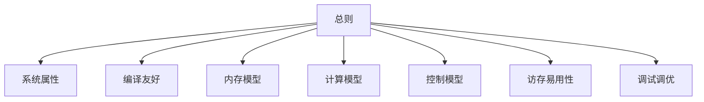

# 硬件易用性度量

## 总则

| 章节 | 回答的问题 |
|---|---|
| S1 系统属性 | 硬件规格与代际契约是什么 |
| S2 编译友好 | 编译器必需暴露 |
| S3 内存模型 | 层级、容量、一致性如何暴露 |
| S4 计算模型 | 计算引擎与指令如何表达 |
| S5 控制模型 | 同步与序如何写 |
| S6 访存易用性 | 数据怎么搬、对齐、随路 |
| S7 调试调优 | 能否看见、复现、隔离、归因 |

### 评分模型

归一化到 $[0,100]$：100 全自动、80 自动为主、60 手动可管理、0 完全手动。越大越好，按阈值分段（见下式）。

$$
s=
\begin{cases}
100,& x\ge\tau_{90}\\
80,& x\ge\tau_{80}\\
60,& x\ge\tau_{60}\\
0,& x<\tau_{60}
\end{cases}
\quad\text{（越大越好）}
$$

越小越好的子项先取倒数或取 $1-x$，再套上式，使章节内比较方向一致。

权重 $\Omega_{p,d}$：

| $p$ | $\S1$ | $\S2$ | $\S3$ | $\S4$ | $\S5$ | $\S6$ | $\S7$ |
|---|---|---|---|---|---|---|---|
| 60% | 0.10 | 0.18 | 0.14 | 0.12 | 0.16 | 0.14 | 0.16 |
| 90% | 0.12 | 0.20 | 0.12 | 0.14 | 0.14 | 0.14 | 0.14 |
| 99% | 0.10 | 0.16 | 0.14 | 0.16 | 0.14 | 0.14 | 0.16 |

红线不可加权补偿，任一不达标则 $U_p^{*}=0$：

- 类型完备（S2）
- 编译器确定性（S2）
- 核级复位（S7）
- SDC 静默数据损坏（S7）

---

## S1 系统属性

代际、配比、类型、互联等硬件规格与系统契约。

| 度量子项 | 度量目标 | 度量权重 |
|---|---|---|
| 访存带宽 | 大模型 shape 越容易写到高性能，越易用 | 100% |
| 源码跨代可移植性 | 跨代少改或不改即可编译通过 | 0% |
| 跨代性能达成率 | 跨代重编译后性能接近上一代达成率 | 0% |

### S1-D1 访存带宽

+ 度量方案介绍：
  + 基于 TileSize / BurstLen / Stride / CoreNum 等维度展开，确认相同场景下达成带宽 90%、80%、70% 等约束下，约束越少越好。
  + 针对如下维度，确认各自的带宽打满条件，条件越宽松越好。
  + 1. TileSize：8K–64K
  + 2. BurstLen：32B / 64B / 128B / 256B
  + 3. 非对齐 / 32B / 64B / 128B 对齐
  + 4. 核数：1/4、1/2、3/4、1
+ BenchMark 选择：
  + STREAM / copy、Embedding、Softmax、Attention 等访存墙算子；对照 Matmul 等计算墙算子，避免把算力瓶颈误判为带宽未打满。

### S1-D2 源码跨代可移植性

+ 度量方案介绍：
  + **度量方案**：跨代源码编译通过率，并与 S1-D3 性能达成率分开记账。
  + 1. kernel / host 一行不修改：记 100。
  + 2. 否则按 $(\text{新代码行}-\text{原始代码行})/\text{原始代码行}$ 正则化，改动越小分越高。
+ BenchMark 选择：
  + 上一代已合入的 Attention、MoE、Embedding、Norm、PagedAttention 等生产 kernel；host 侧启动、图编译与运行时配置一并纳入。

#### S1-D3 跨代性能达成率

+ 度量方案介绍：
  + 同一套 kernel 在新一代硬件上重编译后，相对上一代达成率（或相对本代屋顶）的比值。
  + 只改编译选项、不改算法时单独出一档；允许改 tiling / 流水时另出一档，避免把算法重写算进“跨代”。
+ BenchMark 选择：
  + 与 S1-D2 同一批跨代 kernel；按访存墙 / 计算墙拆开报，避免单一几何平均掩盖带宽项。

---

## S2 编译友好

编译器必须向编程模型暴露的能力、语义、确定性与可达性能。

| 度量子项 | 度量目标 | 度量权重 |
|---|---|---|
| 编译器覆盖 | ISA / intrinsic / 类型 / 同步原语可被编译到 | 20% |
| 编译器语义对齐 | 编译结果与硬件手册一致 | 15% |
| 编译器确定性 | 同输入同输出，可复现 | 15% |
| 编译器可调试 | 能映射回源、能解释失败 | 15% |
| 编译器性能可达成 | 编译器能吃到手册峰值 | 20% |
| 编译器友好度 | 少写、少特化、少不可移植 | 15% |

### S2-D1 编译器覆盖

+ 度量方案介绍：
  + 以手册 ISA、intrinsic、同步原语、向量 / 矩阵 / 查表指令为清单，统计编译器能选中、能生成、能链接的比例。
  + 缺一条就记一条缺口，不把“能手写汇编绕过”算作覆盖。
+ BenchMark 选择：
  + 官方 ISA 清单 + 生产 kernel 实际用到的指令子集；两张表都报。

### S2-D2 编译器语义对齐

+ 度量方案介绍：
  + 对舍入、饱和、规约顺序、同步可见性做差分：编译器生成代码的行为相对手册黄金模型。
  + 不一致且无文档，直接降档。
+ BenchMark 选择：
  + 规约、softmax、随机舍入、跨核同步前后的可见性用例。

### S2-D3 编译器确定性

+ 度量方案介绍：
  + 同输入、同选项、同工具链版本，重复编译与重复运行的输出 / 代码哈希一致率。
  + 非确定且无种子或无日志，红线不通过。
+ BenchMark 选择：
  + 图编译、自动调优、多线程 codegen；固定种子与不固定种子两档。

### S2-D4 编译器可调试

+ 度量方案介绍：
  + 报错能否指回源行、IR dump、指令映射；失败时能否给出可执行的下一步。
  + 只给内部编号、无源映射，记 0。
+ BenchMark 选择：
  + 故意写错类型、越界、不支持的 intrinsic，看诊断质量。

### S2-D5 编译器性能可达成

+ 度量方案介绍：
  + 编译器自动生成代码相对手写峰值 / 手册屋顶的达成率。
  + 必须手写汇编才能打满，则本项不超过 60。
+ BenchMark 选择：
  + GEMM、Attention、卷积、Gather / Scatter；与 S1-D1 同一套带宽场景交叉验证。

### S2-D6 编译器友好度

+ 度量方案介绍：
  + 为打满性能需要写的特化代码行、#ifdef 代数、不可移植 intrinsic 占比。
  + 越少特化越好。
+ BenchMark 选择：
  + 同一算子的“可移植写法”与“打满写法”行数比。

---

## S3 内存模型

层级、容量、一致性、别名与编址如何暴露给软件。

| 度量子项 | 度量目标 | 度量权重 |
|---|---|---|
| 层级与容量 | 各层容量、延迟、可见范围说得清 | 20% |
| 一致性与同步点 | 何时可见、谁负责刷 | 20% |
| 编址与别名 | 指针、别名、多视图不靠猜 | 15% |
| 容量规划 | 大模型工作集能否一次放下或可分页 | 15% |
| 精度与存储密度 | 低精度 / 稀疏如何映射到物理容量 | 15% |
| 软件管理开销 | 程序员要不要手管每层 | 15% |

### S3-D1 层级与容量

+ 度量方案介绍：
  + 文档与 API 是否给出每层容量、线宽、bank、核可见范围；缺一项记一项缺口。
+ BenchMark 选择：
  + 手册条款对照表；用微基准验证容量与延迟是否与文档同量级。

### S3-D2 一致性与同步点

+ 度量方案介绍：
  + 列出必须插入的 fence / barrier / cache op；能自动插入记高分，必须手插且无文档记低分。
+ BenchMark 选择：
  + producer–consumer、跨核归约、host–device 可见性。

### S3-D3 编址与别名

+ 度量方案介绍：
  + 同一块物理内存的多视图、跨核指针、别名规则是否有类型或 API 约束。
+ BenchMark 选择：
  + 双缓冲、权重共享、KV cache 多头视图。

### S3-D4 容量规划

+ 度量方案介绍：
  + 给定 batch / 序列长 / 层数，工作集是否超出片上 / 片外容量；超出时是否有官方分页或换出路径。
+ BenchMark 选择：
  + 长上下文 Attention、MoE expert 驻留、Embedding 表。

### S3-D5 精度与存储密度

+ 度量方案介绍：
  + FP8 / INT8 / 稀疏 / 压缩格式占用与计算精度是否可在同一套地址空间表达。
+ BenchMark 选择：
  + 权重量化、KV cache 量化、稀疏索引。

### S3-D6 软件管理开销

+ 度量方案介绍：
  + 为正确性必须手写的搬移、刷缓存、双缓冲行数占 kernel 行数的比例。
+ BenchMark 选择：
  + 与 S6 同一批搬移场景，本项只计“为正确性而写”的部分。

---

## S4 计算模型

计算引擎、指令形态、精度与吞吐如何表达。

| 度量子项 | 度量目标 | 度量权重 |
|---|---|---|
| 引擎与指令暴露 | MMA / 向量 / 查表 / 特殊函数可被编程到 | 25% |
| 精度与舍入 | 训练 / 推理精度路径完整且可预期 | 25% |
| 吞吐可达 | 典型 shape 能接近屋顶 | 25% |
| 算子表达力 | 非 GEMM 主干也能写 | 25% |

### S4-D1 引擎与指令暴露

+ 度量方案介绍：
  + 矩阵、向量、特殊函数、查表、转换指令是否有稳定 intrinsic / 编译路径。
+ BenchMark 选择：
  + GEMM、softmax、RoPE、SwiGLU、top-k。

### S4-D2 精度与舍入

+ 度量方案介绍：
  + 支持的 accum / storage 精度组合，以及混合精度的官方推荐路径。
  + 无混合精度路径则训练场景降档。
+ BenchMark 选择：
  + 前向、反向、损失缩放、随机舍入。

### S4-D3 吞吐可达

+ 度量方案介绍：
  + 在生产 shape 下相对理论 FLOP/s 的达成率；必须手写流水才打满则降档。
+ BenchMark 选择：
  + 方阵 / 瘦高 / 胖瘦 GEMM，decode 小 batch，prefill 大序列。

### S4-D4 算子表达力

+ 度量方案介绍：
  + 非规则、非方阵、带 mask / 稀疏的算子能否在同一套计算模型里写完。
+ BenchMark 选择：
  + FlashAttention、Grouped GEMM、MoE dispatch。

---

## S5 控制模型

同步、序、发散、多核协作如何写。

| 度量子项 | 度量目标 | 度量权重 |
|---|---|---|
| 同步原语 | barrier / fence / lock 够用且语义清 | 20% |
| 执行序 | 编译与硬件不擅自破坏程序员序 | 15% |
| 控制发散 | warp / 核内分歧有代价模型 | 15% |
| 多核协作 | 切分、归约、握手有模板 | 20% |
| 主机协同 | host–device 启动与回调不靠黑盒 | 15% |
| 可组合性 | 多流、多图、多任务不互相踩 | 15% |

### S5-D1 同步原语

+ 度量方案介绍：
  + 清单覆盖核内、核间、片间、host–device；每类至少有一种文档化原语。
+ BenchMark 选择：
  + 生产者消费者、树归约、跨片 all-reduce 的软件侧同步。

### S5-D2 执行序

+ 度量方案介绍：
  + 弱序下哪些重排合法、哪些必须 fence；编译器是否插入与手册一致。
+ BenchMark 选择：
  + litmus：load–store、store–load、跨核消息。

### S5-D3 控制发散

+ 度量方案介绍：
  + 分歧时的锁步 / 掩码 / 收敛规则是否文档化，是否有开销公式。
+ BenchMark 选择：
  + 变长序列 mask、MoE 专家分支、不规则 gather。

### S5-D4 多核协作

+ 度量方案介绍：
  + 官方切分、归约、双缓冲握手模板是否存在；没有模板则按手写行数罚分。
+ BenchMark 选择：
  + 多核 GEMM、多核 Attention、多核 softmax。

### S5-D5 主机协同

+ 度量方案介绍：
  + 启动延迟、参数传递、回调、图捕获是否有稳定 API。
+ BenchMark 选择：
  + 小 kernel 启动、多流并发、图回放。

### S5-D6 可组合性

+ 度量方案介绍：
  + 多流、多通信域、多计算图同时存在时，同步与资源命名是否可组合。
+ BenchMark 选择：
  + 训练一步：计算 + 通信 + 换出重叠。

---

## S6 访存易用性

数据怎么搬、对齐、随路处理，以及软件还要补多少。

| 度量子项 | 度量目标 | 度量权重 |
|---|---|---|
| 搬移原语 | copy / DMA / 集体通信可调用 | 20% |
| 对齐与 stride | 非对齐、非常步仍可写 | 20% |
| 随路处理 | 搬移时转换、转置、压缩 | 15% |
| 通信与计算重叠 | 软件不必手拆双缓冲才能重叠 | 15% |
| 间接访存 | gather / scatter / 原子可预期 | 15% |
| 布局约束 | padding / swizzle 能自动或有工具 | 15% |

### S6-D1 搬移原语

+ 度量方案介绍：
  + 片上、片外、host、跨片是否有对称 API；缺一侧就记缺口。
+ BenchMark 选择：
  + 权重量入、激活写出、KV cache 换入换出。

### S6-D2 对齐与 stride

+ 度量方案介绍：
  + 与 S1-D1 同一套对齐 / BurstLen / stride 扫描，本项看**软件是否必须改代码**才能打满，而不是看峰值本身。
+ BenchMark 选择：
  + 与 S1-D1 相同的 TileSize / 对齐 / 核数矩阵。

### S6-D3 随路处理

+ 度量方案介绍：
  + 搬移路径上能否做 cast、transpose、pack / unpack；不能则软件多一遍读改写。
+ BenchMark 选择：
  + 量化权重加载、NHWC↔NCHW、稀疏 pack。

### S6-D4 通信与计算重叠

+ 度量方案介绍：
  + 官方是否提供双缓冲 / async copy / 通信与计算重叠原语；必须手写状态机则降档。
+ BenchMark 选择：
  + 流水 GEMM、Attention 换块、MoE all-to-all。

### S6-D5 间接访存

+ 度量方案介绍：
  + gather / scatter / 原子的吞吐与语义是否文档化，是否有冲突代价模型。
+ BenchMark 选择：
  + Embedding、MoE routing、histogram、原子加。

### S6-D6 布局约束

+ 度量方案介绍：
  + padding、bank conflict、swizzle 是否有编译器或库自动处理。
+ BenchMark 选择：
  + 共享内存转置、卷积 im2col、Attention QK 布局。

---

## S7 调试调优

能否看见、复现、隔离、归因，以及出问题后能否复位。

| 度量子项 | 度量目标 | 度量权重 |
|---|---|---|
| 可见性 | 计数器、轨迹、dump 能看到关键事件 | 15% |
| 复现 | 同输入可复现，或有种子 / 日志 | 15% |
| 隔离 | 能把故障缩到核 / 流 / 算子 | 15% |
| 归因 | 能指向带宽、同步、精度或编译 | 15% |
| 核级复位 | 单核 / 单任务可恢复，不拖死整片 | 15% |
| SDC 防护 | 静默数据损坏可检测或隔离 | 15% |
| 调优闭环 | 有建议、有对比、有回归门禁 | 10% |

### S7-D1 可见性

+ 度量方案介绍：
  + 硬件计数器、PC 采样、内存 trace、编译中间表示是否对用户开放。
+ BenchMark 选择：
  + 一次 Attention kernel 能否同时看到带宽、占用、停顿原因。

### S7-D2 复现

+ 度量方案介绍：
  + 固定种子、固定图、固定工具链后，数值与性能是否可复现。
+ BenchMark 选择：
  + 与 S2-D3 同一批非确定源；本项看运行时，不看编译器。

### S7-D3 隔离

+ 度量方案介绍：
  + 故障能否缩到单核、单流、单算子，而不必重跑整网。
+ BenchMark 选择：
  + 注入错误的 MoE expert、单层 dump、单核 hang。

### S7-D4 归因

+ 度量方案介绍：
  + 性能或正确性失败时，工具是否给出主因类别（带宽、同步、精度、编译、容量）。
+ BenchMark 选择：
  + 故意制造 S1-D1 未打满、故意漏 barrier、故意用错精度，看归因是否命中。

### S7-D5 核级复位

+ 度量方案介绍：
  + 单核超时 / 异常后，能否复位该核并恢复队列，而不重置整片。
  + 做不到则红线不通过。
+ BenchMark 选择：
  + 注入 hang、非法指令、看门狗超时。

### S7-D6 SDC 防护

+ 度量方案介绍：
  + ECC、端到端校验、静默损坏检测是否对用户可见；无法检测则红线不通过。
+ BenchMark 选择：
  + 注入可纠正 / 不可纠正错误，看上报与隔离。

### S7-D7 调优闭环

+ 度量方案介绍：
  + 是否有官方建议（tiling、占用、对齐）、前后对比报告、回归门禁。
+ BenchMark 选择：
  + 从 S1-D1 未打满走到打满的一次调优记录，看工具是否给出可执行建议。
