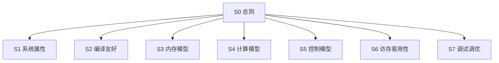

# 硬件易用性度量

> 一份文档，按硬件编程界面重整全部度量。
> 顶级目录：**系统属性 · 编译友好 · 内存模型 · 计算模型 · 控制模型 · 访存易用性 · 调试调优**。
> 章内目录：`### [度量项] 名称` + 表（度量子项 / 度量目标 / 度量方案简介）。大纲 H3 为度量项，H4 为度量子项。
> 原则：客观可复现（源码静态特征 + 硬件锚点）；三档性能（60% / 90% / 99%）驱动权重；数学公式表达。F1–F6 负载亲和只作度量项属性，不参与目录分层。

## 目录

每章目录：`### [度量项] 名称`，下接表「度量子项 / 度量目标 / 度量方案简介」。

- [S1 系统属性](#s1-系统属性)（11 度量项 / 21 度量子项）— 访存带宽、代际、配比、类型、互联等硬件规格与系统契约
  - [[度量项] 访存带宽](#度量项-访存带宽)
  - [[度量项] 源码跨代可移植性](#度量项-源码跨代可移植性)
  - [[度量项] API 破坏性变更](#度量项-api-破坏性变更)
  - [[度量项] 二进制兼容性](#度量项-二进制兼容性)
  - [[度量项] 形态配比保持度](#度量项-形态配比保持度)
  - [[度量项] 算力配比冲击度](#度量项-算力配比冲击度)
  - [[度量项] 配比变化重写量](#度量项-配比变化重写量)
  - [[度量项] 核映射自适应度](#度量项-核映射自适应度)
  - [[度量项] 多版本一致性](#度量项-多版本一致性)
  - [[度量项] 数值/类型支持度](#度量项-数值类型支持度)
  - [[度量项] 通算 overlap 线性可叠加度](#度量项-通算-overlap-线性可叠加度)
- [S2 编译友好](#s2-编译友好)（6 度量项 / 6 度量子项）— 编译器/工具链能自动吸收多少微架构暴露
  - [[度量项] 编译友好屏蔽率](#度量项-编译友好屏蔽率)
  - [[度量项] 自动同步消除率](#度量项-自动同步消除率)
  - [[度量项] 自动 tiling 命中率](#度量项-自动-tiling-命中率)
  - [[度量项] 自动格式转换覆盖率](#度量项-自动格式转换覆盖率)
  - [[度量项] 高层 API 替代覆盖率](#度量项-高层-api-替代覆盖率)
  - [[度量项] 用户实际感知暴露度](#度量项-用户实际感知暴露度)
- [S3 内存模型](#s3-内存模型)（4 度量项 / 6 度量子项）— 层级、片上资源、一致性、初始化
  - [[度量项] 内存层级暴露](#度量项-内存层级暴露)
  - [[度量项] 资源/约束暴露](#度量项-资源约束暴露)
  - [[度量项] 硬件约束暴露（DCCI）](#度量项-硬件约束暴露dcci)
  - [[度量项] 设备初始化](#度量项-设备初始化)
- [S4 计算模型](#s4-计算模型)（4 度量项 / 8 度量子项）— 引擎、指令粒度、数值行为、API–指令耦合
  - [[度量项] 计算复杂度](#度量项-计算复杂度)
  - [[度量项] 计算行为表达](#度量项-计算行为表达)
  - [[度量项] 多流水暴露](#度量项-多流水暴露)
  - [[度量项] API-指令耦合](#度量项-api-指令耦合)
- [S5 控制模型](#s5-控制模型)（3 度量项 / 7 度量子项）— 同步、流水序域、ID 协议
  - [[度量项] 同步暴露](#度量项-同步暴露)
  - [[度量项] 同步流水复杂度](#度量项-同步流水复杂度)
  - [[度量项] ID 残留对消](#度量项-id-残留对消)
- [S6 访存易用性](#s6-访存易用性)（4 度量项 / 5 度量子项）— tiling、地址、对齐、随路搬运
  - [[度量项] 搬运复杂度（tiling）](#度量项-搬运复杂度tiling)
  - [[度量项] 地址计算](#度量项-地址计算)
  - [[度量项] 地址对齐](#度量项-地址对齐)
  - [[度量项] 随路搬运](#度量项-随路搬运)
- [S7 调试调优](#s7-调试调优)（5 度量项 / 16 度量子项）— 可观测、可重放、可隔离、可归因
  - [[度量项] 性能度量覆盖](#度量项-性能度量覆盖)
  - [[度量项] 确定性与重放](#度量项-确定性与重放)
  - [[度量项] 故障隔离与恢复](#度量项-故障隔离与恢复)
  - [[度量项] 错误遥测](#度量项-错误遥测)
  - [[度量项] 源码关联深度](#度量项-源码关联深度)

## S0 总则

### S0-1 三层结构

| 层级 | 标题 | 稳定 ID | Cursor |
|---|---|---|---|
| **章节** | `## S1 系统属性` | `S1` | 大纲 H2 |
| **度量项** | `### [度量项] 访存带宽` | `S1-BW` | 大纲 H3 |
| **度量子项** | 表内一行 + `#### [度量子项] 峰值访存带宽` | `S1-BW-B_peak` | 大纲 H4 |

度量方案（AST / PMU / μ-bench / 故障注入）是子项上的提取方法，不是目录层级。
原建模维 A–E 是易用性税种，作为度量项属性保留。
跳转靠标题 slug（如 `#度量项-访存带宽`）；稳定路径写在正文「路径 `S1-BW`」里，供 `@docs/next.md` 检索。

### S0-2 七章与原分类的关系

| 章节 | 回答的问题 | 原 A–E / F1–F6 中迁入的主项 |
|---|---|---|
| S1 系统属性 | 硬件规格与代际契约是什么 | 访存带宽、D1–D7、A8、B3、E1 |
| S2 编译友好 | 编译器能藏住多少暴露 | A7、A12–A16 |
| S3 内存模型 | 层级、容量、一致性如何暴露 | A1、A5、A6、A10 |
| S4 计算模型 | 计算引擎与指令如何表达 | B2、B7、A2、A4 |
| S5 控制模型 | 同步与序如何写 | A3、A9、A11 |
| S6 访存易用性 | 数据怎么搬、对齐、随路 | B1、B4、B5、B6 |
| S7 调试调优 | 能否看见、复现、隔离、归因 | C1–C5 |

一项只进一章。一行代码同时同步+搬移时按主目的归类：copy 上的隐式 sync 进 S5，copy 本身进 S6。

### S0-3 评分模型

四锚点归一化到 $[0,100]$：100 全自动、80 自动为主、60 手动可管理、0 完全手动。越小越好 / 越大越好按阈值分段（见下式）。

$$
s=
\begin{cases}
100,& x\le\tau_{100}\\
80,& \tau_{100}<x\le\tau_{80}\\
60,& \tau_{80}<x\le\tau_{60}\\
0,& x>\tau_{60}
\end{cases}
\quad\text{（越小越好；越大越好则不等式反向）}
$$

$$
S_{d,j}=\sum_k w_{d,j,k}\,s_{d,j,k},\quad
S_d=\sum_j W_{d,j}\,S_{d,j},\quad
U_p=\sum_d \Omega_{p,d}\,S_d
$$

三档权重 $\Omega_{p,d}$（A–E 税种，不随七章改）：

| $p$ | $\Omega_A$ | $\Omega_B$ | $\Omega_C$ | $\Omega_D$ | $\Omega_E$ |
|---|---|---|---|---|---|
| 60% | 0.182 | 0.227 | 0.136 | 0.068 | 0.182 |
| 90% | 0.367 | 0.286 | 0.094 | 0.080 | 0.137 |
| 99% | 0.342 | 0.213 | 0.139 | 0.108 | 0.197 |

红线不可加权补偿，任一不达标则 $U_p^{*}=\min(U_p,59)$：

| 红线 | 门槛 | 所在章 |
|---|---|---|
| B3 类型完备度 | 主流类型全覆盖 | S1 |
| C2 同输入一致率 | $100\%$ | S7 |
| C3 故障隔离 | 核级复位可用 | S7 |
| C4 错误遥测 / SDC | 覆盖 $\ge 80$，SDC $=0\%$ | S7 |

等级：S $\ge 90$，A $[80,90)$，B $[70,80)$，C $[60,70)$，D $<60$。

章得分（只用于短板定位，不替代 $U_p$）：

$$
S_{S_k}=\frac{\sum_{j\in S_k} W_j^{\mathrm{glob}} S_j}{\sum_{j\in S_k} W_j^{\mathrm{glob}}},\qquad W_j^{\mathrm{glob}}=\Omega_{d(j)}\,W_{d(j),j}
$$

弱亲和项（D2、D3、A12、A16）进 $S_{S_k}$ 时权乘 $0.5$。

### S0-4 负载亲和（属性，非目录）

隔离实验：只动一轴，看采集值谁变最大。F5≠F6（放得下 vs 搬得快），F3≠F4（小 batch 吃不满 vs 算术强度）。

| 亲和 | 隔离轴 | 命中信号 |
|---|---|---|
| F1 互联带宽 | 只改互联或 overlap | $T$ 变；同步/阻塞被触发 |
| F2 数据精度 | 只改精度档 | 正确性或可达性能档跳变 |
| F3 Batch 利用率 | 只改 batch | 效率从低到饱和上升 |
| F4 每 token FLOPs | 只改算力或 $F_{\mathrm{tok}}$ | $T$ 随算力/运算量变 |
| F5 显存容量 | 只加容量、带宽不变 | OOM 消失或去掉重计算 |
| F6 显存敏感 | 只改带宽或层级命中 | $T$ 近似随带宽线性变 |

## S1 系统属性

访存带宽、代际、配比、类型、互联等硬件规格与系统契约。

### [度量项] 访存带宽

路径 `S1-BW` · 建模维 S · 项内权重 $W=—$ · 主/次亲和 F6 / 次 F5

| 度量子项 | 度量目标 | 度量方案简介 |
|---|---|---|
| [`S1-BW-B_peak`](#度量子项-峰值访存带宽) 峰值访存带宽 | 标定可对照的硬件峰值访存带宽 | target spec / 数据手册：HBM/L2 峰值带宽 GB/s |
| [`S1-BW-eta_bw`](#度量子项-有效带宽达成率) 有效带宽达成率 | 实测有效带宽接近峰值 | μ-bench STREAM/copy：实测带宽 / 峰值带宽 |
| [`S1-BW-rho_wall`](#度量子项-带宽墙场景占比) 带宽墙场景占比 | 量化落在带宽墙的场景比例（越低越好） | Roofline μ-bench：落在带宽墙的算子/场景比例 |

#### [度量子项] 峰值访存带宽

符号 $B_{\mathrm{peak}}$ · 方向：大越好 · 权重 $w=0.4$ · 阈值 $按规格对照，不设四锚点$

#### [度量子项] 有效带宽达成率

符号 $\eta_{bw}$ · 方向：大越好 · 权重 $w=0.4$ · 阈值 $\tau_{100}=90\%,\ \tau_{80}=70\%,\ \tau_{60}=50\%$

#### [度量子项] 带宽墙场景占比

符号 $\rho_{\mathrm{wall}}$ · 方向：小越好 · 权重 $w=0.2$ · 阈值 $\tau_{100}=20\%,\ \tau_{80}=40\%,\ \tau_{60}=60\%$

$$
S_{\mathrm{BW}} = 0.4\,s_{B_{\mathrm{peak}}} + 0.4\,s_{\eta_{bw}} + 0.2\,s_{\rho_{\mathrm{wall}}}
$$

> 系统属性增补项，不计入原 A–E 权重和。

**Bench**：STREAM/copy；Softmax / Embedding 带宽墙对照 Matmul

### [度量项] 源码跨代可移植性

路径 `S1-D1` · 建模维 D · 项内权重 $W=0.34$ · 主/次亲和 F4 / 次 F3

| 度量子项 | 度量目标 | 度量方案简介 |
|---|---|---|
| [`S1-D1-eta_port`](#度量子项-跨代零改动编译通过率) 跨代零改动编译通过率 | 跨代源码零改动即可编译通过 | 跨代编译测试：零改动编译通过算子比例 |
| [`S1-D1-eta_perf`](#度量子项-跨代性能达成率) 跨代性能达成率 | recompile 后性能不掉档 | 跨代性能测试：recompile 后性能/原代性能 |

#### [度量子项] 跨代零改动编译通过率

符号 $\eta_{port}$ · 方向：大越好 · 权重 $w=0.6$ · 阈值 $\tau_{100}=100\%,\ \tau_{80}=80\%,\ \tau_{60}=50\%$

#### [度量子项] 跨代性能达成率

符号 $\eta_{perf}$ · 方向：大越好 · 权重 $w=0.4$ · 阈值 $\tau_{100}=100\%,\ \tau_{80}=90\%,\ \tau_{60}=70\%$

$$
S_{D,1} = 0.6\,s_{\eta_{port}} + 0.4\,s_{\eta_{perf}}
$$

### [度量项] API 破坏性变更

路径 `S1-D2` · 建模维 D · 项内权重 $W=0.25$ · 主/次亲和 F2 · 弱

| 度量子项 | 度量目标 | 度量方案简介 |
|---|---|---|
| [`S1-D2-n_brk`](#度量子项-每代-api-破坏性变更数) 每代 API 破坏性变更数 | 每代 API 破坏性变更尽量少 | arch 版本对比：签名/语义破坏性变更数 |
| [`S1-D2-eta_brk`](#度量子项-破坏性变更可检测率) 破坏性变更可检测率 | 破坏性变更能在编译期发现 | 编译期检测：可编译期检测变更比例 |

#### [度量子项] 每代 API 破坏性变更数

符号 $n_{brk}$ · 方向：小越好 · 权重 $w=0.6$ · 阈值 $\tau_{100}=0,\ \tau_{80}=5,\ \tau_{60}=20$

#### [度量子项] 破坏性变更可检测率

符号 $\eta_{det}$ · 方向：大越好 · 权重 $w=0.4$ · 阈值 $\tau_{100}=100\%,\ \tau_{80}=80\%,\ \tau_{60}=50\%$

$$
S_{D,2} = 0.6\,s_{n_{brk}} + 0.4\,s_{\eta_{det}}
$$

### [度量项] 二进制兼容性

路径 `S1-D3` · 建模维 D · 项内权重 $W=0.16$ · 主/次亲和 F5 · 弱

| 度量子项 | 度量目标 | 度量方案简介 |
|---|---|---|
| [`S1-D3-eta_load`](#度量子项-跨代可加载率) 跨代可加载率 | 已编译产物跨代可加载 | 跨代加载测试：已编译算子跨代可加载比例 |

#### [度量子项] 跨代可加载率

符号 $\eta_{load}$ · 方向：大越好 · 权重 $w=1.0$ · 阈值 $\tau_{100}=100\%,\ \tau_{80}=70\%,\ \tau_{60}=30\%$

$$
S_{D,3} = s_{\eta_{load}}
$$

### [度量项] 形态配比保持度

路径 `S1-D4` · 建模维 D · 项内权重 $W=0.09$ · 主/次亲和 F3 / 次 F5

| 度量子项 | 度量目标 | 度量方案简介 |
|---|---|---|
| [`S1-D4-delta_ratio`](#度量子项-形态比变更幅度) 形态比变更幅度 | AIC:AIV 形态比代际保持 | 代际 target spec：AIC:AIV 比值变化幅度 |
| [`S1-D4-rho_rw`](#度量子项-算子重编写比例) 算子重编写比例 | 因形态变化需重写的算子少 | 跨代算子对比：需重编写算子 / 总算子 |

#### [度量子项] 形态比变更幅度

符号 $\Delta_{ratio}$ · 方向：小越好 · 权重 $w=0.5$ · 阈值 $\tau_{100}=0,\ \tau_{80}=0.5,\ \tau_{60}=2.0$

#### [度量子项] 算子重编写比例

符号 $\rho_{rw}$ · 方向：小越好 · 权重 $w=0.5$ · 阈值 $\tau_{100}=0\%,\ \tau_{80}=10\%,\ \tau_{60}=30\%$

$$
S_{D,4} = 0.5\,s_{\Delta_{ratio}} + 0.5\,s_{\rho_{rw}}
$$

### [度量项] 算力配比冲击度

路径 `S1-D5` · 建模维 D · 项内权重 $W=0.09$ · 主/次亲和 F4 / 次 F3

| 度量子项 | 度量目标 | 度量方案简介 |
|---|---|---|
| [`S1-D5-delta_pow`](#度量子项-配比变化幅度) 配比变化幅度 | Cube:Vector:搬运配比代际稳定 | roofline 参数：Cube:Vector:搬运配比变化 |
| [`S1-D5-rho_retune`](#度量子项-tiling流水重调比例) tiling/流水重调比例 | 因配比变化需重调的算子少 | 跨代算子对比：需重调 tiling/流水算子比例 |

#### [度量子项] 配比变化幅度

符号 $\Delta_{pow}$ · 方向：小越好 · 权重 $w=0.5$ · 阈值 $\tau_{100}=0,\ \tau_{80}=0.5,\ \tau_{60}=2.0$

#### [度量子项] tiling/流水重调比例

符号 $\rho_{retune}$ · 方向：小越好 · 权重 $w=0.5$ · 阈值 $\tau_{100}=0\%,\ \tau_{80}=15\%,\ \tau_{60}=40\%$

$$
S_{D,5} = 0.5\,s_{\Delta_{pow}} + 0.5\,s_{\rho_{retune}}
$$

### [度量项] 配比变化重写量

路径 `S1-D6` · 建模维 D · 项内权重 $W=0.04$ · 主/次亲和 F3 / 次 F4

| 度量子项 | 度量目标 | 度量方案简介 |
|---|---|---|
| [`S1-D6-L_rw`](#度量子项-配比变化重写代码行) 配比变化重写代码行 | 配比变化引起的改动量小 | 源代码 diff：因配比变化需修改代码行数 |

#### [度量子项] 配比变化重写代码行

符号 $L_{rw}$ · 方向：小越好 · 权重 $w=1.0$ · 阈值 $\tau_{100}=0,\ \tau_{80}=50,\ \tau_{60}=200$

$$
S_{D,6} = s_{L_{rw}}
$$

### [度量项] 核映射自适应度

路径 `S1-D7` · 建模维 D · 项内权重 $W=0.03$ · 主/次亲和 F3 / 次 F1

| 度量子项 | 度量目标 | 度量方案简介 |
|---|---|---|
| [`S1-D7-eta_nmap`](#度量子项-自动核映射命中率) 自动核映射命中率 | 编译器按 target spec 自动选核 | 编译时统计：据 target spec 自动选择核映射算子比例 |

#### [度量子项] 自动核映射命中率

符号 $\eta_{map}$ · 方向：大越好 · 权重 $w=1.0$ · 阈值 $\tau_{100}=100\%,\ \tau_{80}=70\%,\ \tau_{60}=40\%$

$$
S_{D,7} = s_{\eta_{map}}
$$

### [度量项] 多版本一致性

路径 `S1-A8` · 建模维 A · 项内权重 $W=0.04$ · 主/次亲和 F2 / 次 F4 · 补全

| 度量子项 | 度量目标 | 度量方案简介 |
|---|---|---|
| [`S1-A8-eta_ver`](#度量子项-跨版本行为一致率) 跨版本行为一致率 | 跨版本算子行为一致 | 跨版本对照：行为一致算子 / 总算子 |
| [`S1-A8-n_drift`](#度量子项-跨版本语义漂移数) 跨版本语义漂移数 | 语义漂移条目少 | arch 版本对比：语义漂移条目数 |

#### [度量子项] 跨版本行为一致率

符号 $\eta_{ver}$ · 方向：大越好 · 权重 $w=0.6$ · 阈值 $\tau_{100}=100\%,\ \tau_{80}=80\%,\ \tau_{60}=50\%$

#### [度量子项] 跨版本语义漂移数

符号 $n_{drift}$ · 方向：小越好 · 权重 $w=0.4$ · 阈值 $\tau_{100}=0,\ \tau_{80}=2,\ \tau_{60}=5$

$$
S_{A,8} = 0.6\,s_{\eta_{ver}} + 0.4\,s_{n_{drift}}
$$

### [度量项] 数值/类型支持度

路径 `S1-B3` · 建模维 B · 项内权重 $W=0.07$ · 主/次亲和 F2 · 红线

| 度量子项 | 度量目标 | 度量方案简介 |
|---|---|---|
| [`S1-B3-h_bar`](#度量子项-类型转换平均跳数) 类型转换平均跳数 | 类型转换跳数少，最好原生 | 类型转换二维表：源类型→目标类型平均跳转指令数 |
| [`S1-B3-eta_type`](#度量子项-类型完备度) 类型完备度 | 主流类型原生全覆盖 | 硬件类型矩阵：主流类型原生支持率 |

#### [度量子项] 类型转换平均跳数

符号 $\bar{h}$ · 方向：小越好 · 权重 $w=0.6$ · 阈值 $\tau_{100}=0,\ \tau_{80}=1,\ \tau_{60}=3$

#### [度量子项] 类型完备度

符号 $\eta_{type}$ · 方向：大越好 · 权重 $w=0.4$ · 阈值 $\tau_{100}=100\%,\ \tau_{80}=80\%,\ \tau_{60}=60\%$

$$
S_{B,3} = 0.6\,s_{\bar{h}} + 0.4\,s_{\eta_{type}}
$$

### [度量项] 通算 overlap 线性可叠加度

路径 `S1-E1` · 建模维 E · 项内权重 $W=1.00$ · 主/次亲和 F1 / 次 F4

| 度量子项 | 度量目标 | 度量方案简介 |
|---|---|---|
| [`S1-E1-eta_ov`](#度量子项-overlap-场景占比) overlap 场景占比 | 通算时间逼近 max(Tcomm, Tcomp) | μ-bench 对比：$T_{total}\to\max(T_{comm},T_{comp})$ 的场景占比 |
| [`S1-E1-eta_lin`](#度量子项-叠加效率) 叠加效率 | 叠加效率接近 1 | μ-bench 对比：$(T_{comm}+T_{comp}-T_{total})/\min(T_{comm},T_{comp})$ |
| [`S1-E1-L_blk`](#度量子项-手工同步阻塞代码行) 手工同步阻塞代码行 | 手工阻塞叠加的代码少 | 源代码统计：手工 SetFlag 阻塞叠加代码行 |

#### [度量子项] overlap 场景占比

符号 $\eta_{ov}$ · 方向：大越好 · 权重 $w=0.4$ · 阈值 $\tau_{100}=100\%,\ \tau_{80}=80\%,\ \tau_{60}=50\%$

#### [度量子项] 叠加效率

符号 $\eta_{lin}$ · 方向：大越好 · 权重 $w=0.4$ · 阈值 $\tau_{100}=1.0,\ \tau_{80}=0.8,\ \tau_{60}=0.5$

#### [度量子项] 手工同步阻塞代码行

符号 $L_{blk}$ · 方向：小越好 · 权重 $w=0.2$ · 阈值 $\tau_{100}=0,\ \tau_{80}=3,\ \tau_{60}=10$

$$
S_{E,1} = 0.4\,s_{\eta_{ov}} + 0.4\,s_{\eta_{lin}} + 0.2\,s_{L_{blk}}
$$

> 叠加效率 $\eta_{lin}=(T_{comm}+T_{comp}-T_{total})/\min(T_{comm},T_{comp})$。

**Bench**：AllReduce 通信 + 反向计算 overlap；对照 CUDA NCCL

## S2 编译友好

编译器/工具链能自动吸收多少微架构暴露。

### [度量项] 编译友好屏蔽率

路径 `S2-A7` · 建模维 A · 项内权重 $W=0.10$ · 主/次亲和 F3 / 次 F1

| 度量子项 | 度量目标 | 度量方案简介 |
|---|---|---|
| [`S2-A7-eta_sh`](#度量子项-编译友好屏蔽率) 编译友好屏蔽率 | A1–A6 暴露被编译器自动屏蔽 | 编译时统计：A1–A6 暴露被自动屏蔽比例 |

#### [度量子项] 编译友好屏蔽率

符号 $\eta_{sh}$ · 方向：大越好 · 权重 $w=1.0$ · 阈值 $\tau_{100}=100\%,\ \tau_{80}=70\%,\ \tau_{60}=40\%$

$$
S_{A,7} = s_{\eta_{sh}}
$$

> 原合式含 $\eta_{sync}/\eta_{til}/\eta_{fmt}$，已拆到 A13/A14/A15，本项只计屏蔽率。

### [度量项] 自动同步消除率

路径 `S2-A13` · 建模维 A · 项内权重 $W=0.05$ · 主/次亲和 F1 / 次 F4 · 补全

| 度量子项 | 度量目标 | 度量方案简介 |
|---|---|---|
| [`S2-A13-eta_sync`](#度量子项-自动同步消除率) 自动同步消除率 | 同步由编译器自动插入或消除 | 编译时统计：自动插入同步覆盖算子比例 |

#### [度量子项] 自动同步消除率

符号 $\eta_{sync}$ · 方向：大越好 · 权重 $w=1.0$ · 阈值 $\tau_{100}=100\%,\ \tau_{80}=80\%,\ \tau_{60}=50\%$

$$
S_{A,13} = s_{\eta_{sync}}
$$

### [度量项] 自动 tiling 命中率

路径 `S2-A14` · 建模维 A · 项内权重 $W=0.04$ · 主/次亲和 F3 / 次 F4 · 补全

| 度量子项 | 度量目标 | 度量方案简介 |
|---|---|---|
| [`S2-A14-eta_til`](#度量子项-自动-tiling-命中率) 自动 tiling 命中率 | 自动搜索 tiling 能命中 | autotuning 统计：自动搜索 tiling 命中算子比例 |

#### [度量子项] 自动 tiling 命中率

符号 $\eta_{til}$ · 方向：大越好 · 权重 $w=1.0$ · 阈值 $\tau_{100}=100\%,\ \tau_{80}=70\%,\ \tau_{60}=40\%$

$$
S_{A,14} = s_{\eta_{til}}
$$

### [度量项] 自动格式转换覆盖率

路径 `S2-A15` · 建模维 A · 项内权重 $W=0.02$ · 主/次亲和 F2 / 次 F6 · 补全

| 度量子项 | 度量目标 | 度量方案简介 |
|---|---|---|
| [`S2-A15-eta_fmt`](#度量子项-自动格式转换覆盖率) 自动格式转换覆盖率 | 格式/dtype 转换自动完成 | 编译时统计：自动 dn2nz/nd2nz 覆盖算子比例 |

#### [度量子项] 自动格式转换覆盖率

符号 $\eta_{fmt}$ · 方向：大越好 · 权重 $w=1.0$ · 阈值 $\tau_{100}=100\%,\ \tau_{80}=70\%,\ \tau_{60}=40\%$

$$
S_{A,15} = s_{\eta_{fmt}}
$$

### [度量项] 高层 API 替代覆盖率

路径 `S2-A12` · 建模维 A · 项内权重 $W=0.05$ · 主/次亲和 F3 · 弱 · 补全

| 度量子项 | 度量目标 | 度量方案简介 |
|---|---|---|
| [`S2-A12-eta_hl`](#度量子项-高层-api-覆盖率) 高层 API 覆盖率 | 高层 API 能替代手写 tiling/搬运 | 工具链统计：可被高层 API 替代的算子比例 |

#### [度量子项] 高层 API 覆盖率

符号 $\eta_{hl}$ · 方向：大越好 · 权重 $w=1.0$ · 阈值 $\tau_{100}=100\%,\ \tau_{80}=70\%,\ \tau_{60}=40\%$

$$
S_{A,12} = s_{\eta_{hl}}
$$

### [度量项] 用户实际感知暴露度

路径 `S2-A16` · 建模维 A · 项内权重 $W=0.02$ · 主/次亲和 F4 · 弱 · 补全

| 度量子项 | 度量目标 | 度量方案简介 |
|---|---|---|
| [`S2-A16-n_perc`](#度量子项-用户须感知暴露项数) 用户须感知暴露项数 | 用户须填写的微架构参数少 | API/文档暴露清单：用户必须填写的微架构参数个数 |

#### [度量子项] 用户须感知暴露项数

符号 $n_{perc}$ · 方向：小越好 · 权重 $w=1.0$ · 阈值 $\tau_{100}=0,\ \tau_{80}=3,\ \tau_{60}=8$

$$
S_{A,16} = s_{n_{perc}}
$$

## S3 内存模型

层级、片上资源、一致性、初始化。

### [度量项] 内存层级暴露

路径 `S3-A1` · 建模维 A · 项内权重 $W=0.12$ · 主/次亲和 F6 / 次 F5

| 度量子项 | 度量目标 | 度量方案简介 |
|---|---|---|
| [`S3-A1-deltaK`](#度量子项-tiling-key-增长量) Tiling Key 增长量 | 新增内存层不增加 Tiling Key | Tiling 参数扫描：每新增一层内存层级，Tiling Key 增加个数 |
| [`S3-A1-r_mv`](#度量子项-搬运代码行占比) 搬运代码行占比 | 搬运代码在算子中占比低 | 源代码统计：搬运代码行 / 算子总代码行 |

#### [度量子项] Tiling Key 增长量

符号 $\Delta K$ · 方向：小越好 · 权重 $w=0.5$ · 阈值 $\tau_{100}=0,\ \tau_{80}=2,\ \tau_{60}=5$

#### [度量子项] 搬运代码行占比

符号 $r_{mv}$ · 方向：小越好 · 权重 $w=0.5$ · 阈值 $\tau_{100}=5\%,\ \tau_{80}=15\%,\ \tau_{60}=30\%$

$$
S_{A,1} = 0.5\,s_{\Delta K} + 0.5\,s_{r_{mv}}
$$

**Bench**：Gelu vs Gelu_Reg；Softmax（GM+UB）vs Matmul（6 层）

### [度量项] 资源/约束暴露

路径 `S3-A5` · 建模维 A · 项内权重 $W=0.04$ · 主/次亲和 F5 / 次 F3

| 度量子项 | 度量目标 | 度量方案简介 |
|---|---|---|
| [`S3-A5-L_mm`](#度量子项-内存管理代码行) 内存管理代码行 | UB/L1/L0 分配与管理代码少 | 源代码统计：UB/L1/L0 分配与地址计算代码行 |
| [`S3-A5-L_id`](#度量子项-id-管理代码行) ID 管理代码行 | block/同步 ID 管理代码少 | 源代码统计：block_idx/同步 ID 管理代码行 |

#### [度量子项] 内存管理代码行

符号 $L_{mm}$ · 方向：小越好 · 权重 $w=0.625$ · 阈值 $\tau_{100}=0,\ \tau_{80}=20,\ \tau_{60}=50$

#### [度量子项] ID 管理代码行

符号 $L_{id}$ · 方向：小越好 · 权重 $w=0.375$ · 阈值 $\tau_{100}=0,\ \tau_{80}=10,\ \tau_{60}=30$

$$
S_{A,5} = (0.5\,s_{L_{mm}} + 0.3\,s_{L_{id}})/0.8
$$

> $L_{init}$ 已拆到 A10，本项对剩余两子项重归一。

### [度量项] 硬件约束暴露（DCCI）

路径 `S3-A6` · 建模维 A · 项内权重 $W=0.04$ · 主/次亲和 F6 / 次 F1

| 度量子项 | 度量目标 | 度量方案简介 |
|---|---|---|
| [`S3-A6-L_dcci`](#度量子项-dcci-代码行) DCCI 代码行 | 预取/无效化/一致性代码少 | 源代码统计：预取/无效化/同步代码行 |

#### [度量子项] DCCI 代码行

符号 $L_{dcci}$ · 方向：小越好 · 权重 $w=1.0$ · 阈值 $\tau_{100}=0,\ \tau_{80}=10,\ \tau_{60}=30$

$$
S_{A,6} = s_{L_{dcci}}
$$

> $L_{cancel}$ 已拆到 A11。

### [度量项] 设备初始化

路径 `S3-A10` · 建模维 A · 项内权重 $W=0.02$ · 主/次亲和 F5 · 补全

| 度量子项 | 度量目标 | 度量方案简介 |
|---|---|---|
| [`S3-A10-L_init`](#度量子项-设备初始化代码行) 设备初始化代码行 | AIC/AIV 初始化代码少 | 源代码统计：AIC/AIV 操作单元初始化代码行 |

#### [度量子项] 设备初始化代码行

符号 $L_{init}$ · 方向：小越好 · 权重 $w=1.0$ · 阈值 $\tau_{100}=0,\ \tau_{80}=10,\ \tau_{60}=30$

$$
S_{A,10} = s_{L_{init}}
$$

## S4 计算模型

引擎、指令粒度、数值行为、API–指令耦合。

### [度量项] 计算复杂度

路径 `S4-B2` · 建模维 B · 项内权重 $W=0.13$ · 主/次亲和 F4

| 度量子项 | 度量目标 | 度量方案简介 |
|---|---|---|
| [`S4-B2-rho_ins`](#度量子项-指令粒度比) 指令粒度比 | CCEC 指令粒度接近 PTX | CCEC vs PTX：CCEC 指令数 / PTX 指令数 |

#### [度量子项] 指令粒度比

符号 $\rho_{ins}$ · 方向：小越好 · 权重 $w=1.0$ · 阈值 $\tau_{100}=1.0,\ \tau_{80}=1.5,\ \tau_{60}=3.0$

$$
S_{B,2} = s_{\rho_{ins}}
$$

### [度量项] 计算行为表达

路径 `S4-B7` · 建模维 B · 项内权重 $W=0.04$ · 主/次亲和 F4 / 次 F2 · 补全

| 度量子项 | 度量目标 | 度量方案简介 |
|---|---|---|
| [`S4-B7-n_beh`](#度量子项-显式饱和舍入特殊函数调用数) 显式饱和/舍入/特殊函数调用数 | 少手写饱和、舍入、特殊函数 | 源代码统计：须手写的数值行为插桩次数 |

#### [度量子项] 显式饱和/舍入/特殊函数调用数

符号 $n_{beh}$ · 方向：小越好 · 权重 $w=1.0$ · 阈值 $\tau_{100}=0,\ \tau_{80}=2,\ \tau_{60}=6$

$$
S_{B,7} = s_{n_{beh}}
$$

### [度量项] 多流水暴露

路径 `S4-A2` · 建模维 A · 项内权重 $W=0.08$ · 主/次亲和 F4 / 次 F1

| 度量子项 | 度量目标 | 度量方案简介 |
|---|---|---|
| [`S4-A2-r_sw`](#度量子项-pipeline-切换手动同步代码占比) Pipeline 切换手动同步代码占比 | 少手写流水切换同步 | 源代码统计：SetFlag/WaitFlag 代码行 / 总代码行 |
| [`S4-A2-eta_auto`](#度量子项-自动同步覆盖率) 自动同步覆盖率 | 流水同步自动覆盖 | 编译时统计：自动插入同步覆盖算子比例 |
| [`S4-A2-n_VF`](#度量子项-vf-表达数) VF 表达数 | 单算子须写的 VF 少 | 源代码统计：单算子需编写的 VF 个数 |

#### [度量子项] Pipeline 切换手动同步代码占比

符号 $r_{sw}$ · 方向：小越好 · 权重 $w=0.5$ · 阈值 $\tau_{100}=0\%,\ \tau_{80}=5\%,\ \tau_{60}=15\%$

#### [度量子项] 自动同步覆盖率

符号 $\eta_{auto}$ · 方向：大越好 · 权重 $w=0.3$ · 阈值 $\tau_{100}=100\%,\ \tau_{80}=80\%,\ \tau_{60}=50\%$

#### [度量子项] VF 表达数

符号 $n_{VF}$ · 方向：小越好 · 权重 $w=0.2$ · 阈值 $\tau_{100}=1,\ \tau_{80}=2,\ \tau_{60}=4$

$$
S_{A,2} = 0.5\,s_{r_{sw}} + 0.3\,s_{\eta_{auto}} + 0.2\,s_{n_{VF}}
$$

**Bench**：Softmax（两阶段）/ Matmul（三阶段）/ Conv2D（多阶段）

### [度量项] API-指令耦合

路径 `S4-A4` · 建模维 A · 项内权重 $W=0.08$ · 主/次亲和 F4 / 次 F2

| 度量子项 | 度量目标 | 度量方案简介 |
|---|---|---|
| [`S4-A4-p_bar`](#度量子项-入参平均数) 入参平均数 | API 平均入参少 | 源代码 API 签名：分类平均参数数量 |
| [`S4-A4-n_reg`](#度量子项-寄存器配置数) 寄存器配置数 | 须显式配置的寄存器少 | 硬件寄存器映射：单指令需显式配置的寄存器数 |
| [`S4-A4-delta_sig`](#度量子项-跨版本签名差异数) 跨版本签名差异数 | 跨版本 API 签名稳定 | arch 版本对比：API 签名差异数 |

#### [度量子项] 入参平均数

符号 $\bar{p}$ · 方向：小越好 · 权重 $w=0.4$ · 阈值 $\tau_{100}=2,\ \tau_{80}=5,\ \tau_{60}=10$

#### [度量子项] 寄存器配置数

符号 $n_{reg}$ · 方向：小越好 · 权重 $w=0.4$ · 阈值 $\tau_{100}=0,\ \tau_{80}=3,\ \tau_{60}=10$

#### [度量子项] 跨版本签名差异数

符号 $\Delta_{sig}$ · 方向：小越好 · 权重 $w=0.2$ · 阈值 $\tau_{100}=0,\ \tau_{80}=2,\ \tau_{60}=5$

$$
S_{A,4} = 0.4\,s_{\bar{p}} + 0.4\,s_{n_{reg}} + 0.2\,s_{\Delta_{sig}}
$$

**Bench**：asc_copy_gm2ub / asc_copy_l0c2gm（20+ 参数）

## S5 控制模型

同步、流水序域、ID 协议。

### [度量项] 同步暴露

路径 `S5-A3` · 建模维 A · 项内权重 $W=0.10$ · 主/次亲和 F1 / 次 F4

| 度量子项 | 度量目标 | 度量方案简介 |
|---|---|---|
| [`S5-A3-n_intra`](#度量子项-核内同步调用数) 核内同步调用数 | 核内 SetFlag/WaitFlag 少 | 源代码统计：单算子 SetFlag/WaitFlag 调用次数 |
| [`S5-A3-n_inter`](#度量子项-核间同步调用数) 核间同步调用数 | 核间 CrossCore 同步少 | 源代码统计：CrossCore SetFlag/WaitFlag 次数 |
| [`S5-A3-eta_xcore`](#度量子项-自动核间同步覆盖率) 自动核间同步覆盖率 | 核间同步自动覆盖 | 编译时统计：自动核间同步覆盖算子比例 |

#### [度量子项] 核内同步调用数

符号 $n_{intra}$ · 方向：小越好 · 权重 $w=0.4$ · 阈值 $\tau_{100}=0,\ \tau_{80}=3,\ \tau_{60}=8$

#### [度量子项] 核间同步调用数

符号 $n_{inter}$ · 方向：小越好 · 权重 $w=0.4$ · 阈值 $\tau_{100}=0,\ \tau_{80}=2,\ \tau_{60}=6$

#### [度量子项] 自动核间同步覆盖率

符号 $\eta_{xcore}$ · 方向：大越好 · 权重 $w=0.2$ · 阈值 $\tau_{100}=100\%,\ \tau_{80}=70\%,\ \tau_{60}=40\%$

$$
S_{A,3} = 0.4\,s_{n_{intra}} + 0.4\,s_{n_{inter}} + 0.2\,s_{\eta_{xcore}}
$$

**Bench**：Softmax/Matmul 算子级同步；多核 AllReduce CrossCore 同步

### [度量项] 同步流水复杂度

路径 `S5-A9` · 建模维 A · 项内权重 $W=0.04$ · 主/次亲和 F1 / 次 F4 · 补全

| 度量子项 | 度量目标 | 度量方案简介 |
|---|---|---|
| [`S5-A9-n_pipe`](#度量子项-流水级数) 流水级数 | 须手写的流水级数少 | 源代码阶段划分：单算子手动流水阶段数 |
| [`S5-A9-n_ord`](#度量子项-序域个数) 序域个数 | 须同时记住的序域少 | 同步原语扫描：须同时记住的序域（核内/核间/Host）个数 |

#### [度量子项] 流水级数

符号 $n_{pipe}$ · 方向：小越好 · 权重 $w=0.5$ · 阈值 $\tau_{100}=1,\ \tau_{80}=3,\ \tau_{60}=6$

#### [度量子项] 序域个数

符号 $n_{ord}$ · 方向：小越好 · 权重 $w=0.5$ · 阈值 $\tau_{100}=1,\ \tau_{80}=2,\ \tau_{60}=4$

$$
S_{A,9} = 0.5\,s_{n_{pipe}} + 0.5\,s_{n_{ord}}
$$

### [度量项] ID 残留对消

路径 `S5-A11` · 建模维 A · 项内权重 $W=0.02$ · 主/次亲和 F1 · 补全

| 度量子项 | 度量目标 | 度量方案简介 |
|---|---|---|
| [`S5-A11-L_cancel`](#度量子项-id-对消代码行) ID 对消代码行 | ID 对消代码少 | 源代码统计：GetBlockIdx 消歧代码行 |
| [`S5-A11-n_resid`](#度量子项-对消后残留次数) 对消后残留次数 | 对消后同步 ID 无残留 | 运行时 ID 扫描：同步 ID 残留次数 |

#### [度量子项] ID 对消代码行

符号 $L_{cancel}$ · 方向：小越好 · 权重 $w=0.6$ · 阈值 $\tau_{100}=0,\ \tau_{80}=5,\ \tau_{60}=15$

#### [度量子项] 对消后残留次数

符号 $n_{resid}$ · 方向：小越好 · 权重 $w=0.4$ · 阈值 $\tau_{100}=0,\ \tau_{80}=1,\ \tau_{60}=3$

$$
S_{A,11} = 0.6\,s_{L_{cancel}} + 0.4\,s_{n_{resid}}
$$

## S6 访存易用性

tiling、地址、对齐、随路搬运。

### [度量项] 搬运复杂度（tiling）

路径 `S6-B1` · 建模维 B · 项内权重 $W=0.33$ · 主/次亲和 F3 / 次 F6

| 度量子项 | 度量目标 | 度量方案简介 |
|---|---|---|
| [`S6-B1-n_til`](#度量子项-tiling-参数个数) Tiling 参数个数 | tiling 参数个数少 | 源代码统计：block_dim/tile_len_M/N/K 参数数 |

#### [度量子项] Tiling 参数个数

符号 $n_{til}$ · 方向：小越好 · 权重 $w=1.0$ · 阈值 $\tau_{100}=2,\ \tau_{80}=6,\ \tau_{60}=12$

$$
S_{B,1} = s_{n_{til}}
$$

> 地址/对齐/随路已拆到 B4/B5/B6，本项只计 tiling 参数。

**Bench**：Matmul / Conv2D（im2col 后 tile）/ Embedding

### [度量项] 地址计算

路径 `S6-B4` · 建模维 B · 项内权重 $W=0.17$ · 主/次亲和 F6 / 次 F5 · 补全

| 度量子项 | 度量目标 | 度量方案简介 |
|---|---|---|
| [`S6-B4-L_addr`](#度量子项-地址计算代码行) 地址计算代码行 | 多级地址计算代码少 | 源代码统计：地址偏移计算代码行 |

#### [度量子项] 地址计算代码行

符号 $L_{addr}$ · 方向：小越好 · 权重 $w=1.0$ · 阈值 $\tau_{100}=0,\ \tau_{80}=20,\ \tau_{60}=50$

$$
S_{B,4} = s_{L_{addr}}
$$

### [度量项] 地址对齐

路径 `S6-B5` · 建模维 B · 项内权重 $W=0.13$ · 主/次亲和 F6 / 次 F3 · 补全

| 度量子项 | 度量目标 | 度量方案简介 |
|---|---|---|
| [`S6-B5-n_pad`](#度量子项-对齐边界分支数) 对齐边界分支数 | 对齐/padding 分支少 | 源代码统计：padding/边界分支数 |

#### [度量子项] 对齐边界分支数

符号 $n_{pad}$ · 方向：小越好 · 权重 $w=1.0$ · 阈值 $\tau_{100}=0,\ \tau_{80}=3,\ \tau_{60}=8$

$$
S_{B,5} = s_{n_{pad}}
$$

### [度量项] 随路搬运

路径 `S6-B6` · 建模维 B · 项内权重 $W=0.13$ · 主/次亲和 F2 / 次 F6 · 补全

| 度量子项 | 度量目标 | 度量方案简介 |
|---|---|---|
| [`S6-B6-n_fix`](#度量子项-随路互斥拆分步数) 随路互斥拆分步数 | FIXPIPE 随路少拆步 | 硬件 FIXPIPE 互斥表：互斥随路组合需拆分步数 |
| [`S6-B6-n_fmt`](#度量子项-格式转换调用数) 格式转换调用数 | 显式 dn2nz/nd2nz 少 | 源代码统计：dn2nz/nd2nz 调用次数 |

#### [度量子项] 随路互斥拆分步数

符号 $n_{fix}$ · 方向：小越好 · 权重 $w=0.6$ · 阈值 $\tau_{100}=0,\ \tau_{80}=2,\ \tau_{60}=5$

#### [度量子项] 格式转换调用数

符号 $n_{fmt}$ · 方向：小越好 · 权重 $w=0.4$ · 阈值 $\tau_{100}=0,\ \tau_{80}=2,\ \tau_{60}=5$

$$
S_{B,6} = 0.6\,s_{n_{fix}} + 0.4\,s_{n_{fmt}}
$$

## S7 调试调优

可观测、可重放、可隔离、可归因。

### [度量项] 性能度量覆盖

路径 `S7-C1` · 建模维 C · 项内权重 $W=0.33$ · 主/次亲和 F4 / 次 F6

| 度量子项 | 度量目标 | 度量方案简介 |
|---|---|---|
| [`S7-C1-eta_evt`](#度量子项-关键性能事件覆盖率) 关键性能事件覆盖率 | 关键性能事件可采集全覆盖 | 硬件 PMU 事件集：可采集事件类型数 / 性能模型要求事件类型总数 |
| [`S7-C1-eps_met`](#度量子项-指标相对误差) 指标相对误差 | 观测值相对参考误差小 | μ-bench/硬件仿真：$\|\mathrm{观测}-\mathrm{参考}\|/\mathrm{参考}$ |
| [`S7-C1-rho_loss`](#度量子项-数据丢失率) 数据丢失率 | trace 不丢记录 | 硬件 trace 缓冲区：丢失记录数 / 理论应生成记录数 |
| [`S7-C1-eta_stall`](#度量子项-stall-原因解释覆盖率) Stall 原因解释覆盖率 | Stall 周期可归因 | 硬件 Stall 计数器：可归因阻塞周期 / 总阻塞周期 |

#### [度量子项] 关键性能事件覆盖率

符号 $\eta_{evt}$ · 方向：大越好 · 权重 $w=0.4$ · 阈值 $\tau_{100}=100\%,\ \tau_{80}=80\%,\ \tau_{60}=50\%$

#### [度量子项] 指标相对误差

符号 $\epsilon_{met}$ · 方向：小越好 · 权重 $w=0.3$ · 阈值 $\tau_{100}=1\%,\ \tau_{80}=5\%,\ \tau_{60}=15\%$

#### [度量子项] 数据丢失率

符号 $\rho_{loss}$ · 方向：小越好 · 权重 $w=0.15$ · 阈值 $\tau_{100}=0\%,\ \tau_{80}=1\%,\ \tau_{60}=5\%$

#### [度量子项] Stall 原因解释覆盖率

符号 $\eta_{stall}$ · 方向：大越好 · 权重 $w=0.15$ · 阈值 $\tau_{100}=95\%,\ \tau_{80}=80\%,\ \tau_{60}=60\%$

$$
S_{C,1} = 0.4\,s_{\eta_{evt}} + 0.3\,s_{\epsilon_{met}} + 0.15\,s_{\rho_{loss}} + 0.15\,s_{\eta_{stall}}
$$

**Bench**：Matmul bank 冲突 / Softmax stall / CUBE·VEC·SCALAR·MTE 典型指令

### [度量项] 确定性与重放

路径 `S7-C2` · 建模维 C · 项内权重 $W=0.20$ · 主/次亲和 F2 / 次 F1 · 红线

| 度量子项 | 度量目标 | 度量方案简介 |
|---|---|---|
| [`S7-C2-eta_det`](#度量子项-同输入结果一致率) 同输入结果一致率 | 同输入结果 100% 一致 | 多次实跑比对：结果一致次数 / 总运行次数 |
| [`S7-C2-eta_rep`](#度量子项-执行顺序可重放率) 执行顺序可重放率 | 执行顺序可重放 | 硬件执行 trace：可重放任务比例 |

#### [度量子项] 同输入结果一致率

符号 $\eta_{det}$ · 方向：大越好 · 权重 $w=0.6$ · 阈值 $\tau_{100}=100\%,\ \tau_{80}=99\%,\ \tau_{60}=95\%$

#### [度量子项] 执行顺序可重放率

符号 $\eta_{rep}$ · 方向：大越好 · 权重 $w=0.4$ · 阈值 $\tau_{100}=100\%,\ \tau_{80}=80\%,\ \tau_{60}=50\%$

$$
S_{C,2} = 0.6\,s_{\eta_{det}} + 0.4\,s_{\eta_{rep}}
$$

### [度量项] 故障隔离与恢复

路径 `S7-C3` · 建模维 C · 项内权重 $W=0.13$ · 主/次亲和 F1 / 次 F5 · 红线

| 度量子项 | 度量目标 | 度量方案简介 |
|---|---|---|
| [`S7-C3-g_rst`](#度量子项-最小复位范围) 最小复位范围 | 复位粒度到核级 | 硬件复位粒度：复位粒度等级（核/引擎/卡级） |
| [`S7-C3-eta_rst`](#度量子项-局部复位成功率) 局部复位成功率 | 局部复位成功 | 故障注入：局部复位成功次数 / 故障注入次数 |
| [`S7-C3-MTTR`](#度量子项-平均恢复时间) 平均恢复时间 | 故障恢复时间短 | 故障注入计时：故障恢复平均时间 |

#### [度量子项] 最小复位范围

符号 $g_{rst}$ · 方向：核级最好越好 · 权重 $w=0.4$ · 阈值 $\tau_{100}=\text{核级},\ \tau_{80}=\text{引擎级},\ \tau_{60}=\text{卡级}$

#### [度量子项] 局部复位成功率

符号 $\eta_{rst}$ · 方向：大越好 · 权重 $w=0.3$ · 阈值 $\tau_{100}=100\%,\ \tau_{80}=80\%,\ \tau_{60}=50\%$

#### [度量子项] 平均恢复时间

符号 $\mathrm{MTTR}$ · 方向：小越好 · 权重 $w=0.3$ · 阈值 $\tau_{100}=\text{秒级},\ \tau_{80}=\text{分钟级},\ \tau_{60}=\text{小时级}$

$$
S_{C,3} = 0.4\,s_{g_{rst}} + 0.3\,s_{\eta_{rst}} + 0.3\,s_{\mathrm{MTTR}}
$$

### [度量项] 错误遥测

路径 `S7-C4` · 建模维 C · 项内权重 $W=0.27$ · 主/次亲和 F2 / 次 F1 · 红线

| 度量子项 | 度量目标 | 度量方案简介 |
|---|---|---|
| [`S7-C4-eta_ex`](#度量子项-异常类型覆盖率) 异常类型覆盖率 | 异常类型检测机制全覆盖 | 硬件异常模型：具检测机制异常类型数 / 异常模型定义总数 |
| [`S7-C4-eta_hit_fault`](#度量子项-异常检出率) 异常检出率 | 注入故障能被检出 | 故障注入：正确检测故障次数 / 有效故障注入次数 |
| [`S7-C4-rho_sdc`](#度量子项-静默数据错误率) 静默数据错误率 | 静默数据错误率为 0 | 故障注入：未上报错误结果 / 错误结果总数 |
| [`S7-C4-eta_root`](#度量子项-首因识别率) 首因识别率 | 级联故障能识别首因 | 故障注入级联案例：正确识别首因案例数 / 级联案例总数 |
| [`S7-C4-eta_snap`](#度量子项-现场保存成功率) 现场保存成功率 | 异常后现场可保存 | 硬件现场保存机制：异常后成功保留寄存器/流水/状态比例 |

#### [度量子项] 异常类型覆盖率

符号 $\eta_{ex}$ · 方向：大越好 · 权重 $w=0.25$ · 阈值 $\tau_{100}=100\%,\ \tau_{80}=80\%,\ \tau_{60}=50\%$

#### [度量子项] 异常检出率

符号 $\eta_{det}$ · 方向：大越好 · 权重 $w=0.25$ · 阈值 $\tau_{100}=100\%,\ \tau_{80}=95\%,\ \tau_{60}=80\%$

#### [度量子项] 静默数据错误率

符号 $\rho_{sdc}$ · 方向：小越好 · 权重 $w=0.2$ · 阈值 $\tau_{100}=0\%,\ \tau_{60}=0.1\%$

#### [度量子项] 首因识别率

符号 $\eta_{root}$ · 方向：大越好 · 权重 $w=0.15$ · 阈值 $\tau_{100}=100\%,\ \tau_{80}=80\%,\ \tau_{60}=50\%$

#### [度量子项] 现场保存成功率

符号 $\eta_{snap}$ · 方向：大越好 · 权重 $w=0.15$ · 阈值 $\tau_{100}=100\%,\ \tau_{80}=80\%,\ \tau_{60}=50\%$

$$
S_{C,4} = 0.25\,s_{\eta_{ex}} + 0.25\,s_{\eta_{det}} + 0.2\,s_{\rho_{sdc}} + 0.15\,s_{\eta_{root}} + 0.15\,s_{\eta_{snap}}
$$

### [度量项] 源码关联深度

路径 `S7-C5` · 建模维 C · 项内权重 $W=0.07$ · 主/次亲和 F4

| 度量子项 | 度量目标 | 度量方案简介 |
|---|---|---|
| [`S7-C5-eta_map`](#度量子项-模型算子kernel指令映射完备度) 模型→算子→kernel→指令映射完备度 | 模型→算子→kernel→指令映射完整 | 硬件映射表：关联链完整覆盖率 |
| [`S7-C5-eta_hit`](#度量子项-硬件事件可修改代码命中率) 硬件事件→可修改代码命中率 | 硬件事件能落到可改源码 | 工具链统计：事件可定位到源码比例 |

#### [度量子项] 模型→算子→kernel→指令映射完备度

符号 $\eta_{map}$ · 方向：大越好 · 权重 $w=0.6$ · 阈值 $\tau_{100}=100\%,\ \tau_{80}=80\%,\ \tau_{60}=50\%$

#### [度量子项] 硬件事件→可修改代码命中率

符号 $\eta_{hit}$ · 方向：大越好 · 权重 $w=0.4$ · 阈值 $\tau_{100}=100\%,\ \tau_{80}=70\%,\ \tau_{60}=40\%$

$$
S_{C,5} = 0.6\,s_{\eta_{map}} + 0.4\,s_{\eta_{hit}}
$$
## S8 Benchmark 与执行

| Benchmark | 主压章节 | 次压 | 负载亲和 |
|---|---|---|---|
| Softmax | S6 访存 / S4 计算 | S7 | F6 / F2 / F3 |
| LayerNorm | S1 类型 / S4 | S6 | F2 / F6 |
| Matmul | S4 计算 / S6 tiling | S3 容量 | F4 / F3 / F5 |
| Conv2D | S6 访存 | S4 | F3 / F4 / F6 |
| BatchNorm | S4 / S1 精度 | S6 | F3 / F2 |
| EmbeddingLookup | S3 容量 / S6 | — | F5 / F6 |
| 多核 AllReduce+计算 | S1 互联 / S5 控制 | S4 | F1 / F4 |

1. 冻结芯片、固件、CANN、AscendC；CUDA 对照同步冻结。
2. 目标用户独立实现 AscendC 与 CUDA 参考。
3. 每算子分别打到 60% / 90% / 99% 峰值，记录各档用户代码。
4. 脚本采集子项，禁止人工填报。
5. 先过红线，再按 S0-3 出 $U_p$ 与七章 $S_{S_k}$。
6. 版本追踪同时看 $U_p$ 与章得分差分。

## S9 全量对照

| 度量项 | 章节 | 建模维 | 主亲和 | 弱/红线 |
|---|---|---|---|---|
| BW 访存带宽 | S1 系统属性 | S | F6 |  |
| D1 源码跨代可移植性 | S1 系统属性 | D | F4 |  |
| D2 API 破坏性变更 | S1 系统属性 | D | F2 | 弱 |
| D3 二进制兼容性 | S1 系统属性 | D | F5 | 弱 |
| D4 形态配比保持度 | S1 系统属性 | D | F3 |  |
| D5 算力配比冲击度 | S1 系统属性 | D | F4 |  |
| D6 配比变化重写量 | S1 系统属性 | D | F3 |  |
| D7 核映射自适应度 | S1 系统属性 | D | F3 |  |
| A8 多版本一致性 | S1 系统属性 | A | F2 | 补全 |
| B3 数值/类型支持度 | S1 系统属性 | B | F2 | 红线 |
| E1 通算 overlap 线性可叠加度 | S1 系统属性 | E | F1 |  |
| A7 编译友好屏蔽率 | S2 编译友好 | A | F3 |  |
| A13 自动同步消除率 | S2 编译友好 | A | F1 | 补全 |
| A14 自动 tiling 命中率 | S2 编译友好 | A | F3 | 补全 |
| A15 自动格式转换覆盖率 | S2 编译友好 | A | F2 | 补全 |
| A12 高层 API 替代覆盖率 | S2 编译友好 | A | F3 | 弱 · 补全 |
| A16 用户实际感知暴露度 | S2 编译友好 | A | F4 | 弱 · 补全 |
| A1 内存层级暴露 | S3 内存模型 | A | F6 |  |
| A5 资源/约束暴露 | S3 内存模型 | A | F5 |  |
| A6 硬件约束暴露（DCCI） | S3 内存模型 | A | F6 |  |
| A10 设备初始化 | S3 内存模型 | A | F5 | 补全 |
| B2 计算复杂度 | S4 计算模型 | B | F4 |  |
| B7 计算行为表达 | S4 计算模型 | B | F4 | 补全 |
| A2 多流水暴露 | S4 计算模型 | A | F4 |  |
| A4 API-指令耦合 | S4 计算模型 | A | F4 |  |
| A3 同步暴露 | S5 控制模型 | A | F1 |  |
| A9 同步流水复杂度 | S5 控制模型 | A | F1 | 补全 |
| A11 ID 残留对消 | S5 控制模型 | A | F1 | 补全 |
| B1 搬运复杂度（tiling） | S6 访存易用性 | B | F3 |  |
| B4 地址计算 | S6 访存易用性 | B | F6 | 补全 |
| B5 地址对齐 | S6 访存易用性 | B | F6 | 补全 |
| B6 随路搬运 | S6 访存易用性 | B | F2 | 补全 |
| C1 性能度量覆盖 | S7 调试调优 | C | F4 |  |
| C2 确定性与重放 | S7 调试调优 | C | F2 | 红线 |
| C3 故障隔离与恢复 | S7 调试调优 | C | F1 | 红线 |
| C4 错误遥测 | S7 调试调优 | C | F2 | 红线 |
| C5 源码关联深度 | S7 调试调优 | C | F4 |  |

章节计数：S1=11，S2=6，S3=4，S4=4，S5=3，S6=4，S7=5。子项：S1=21，S2=6，S3=6，S4=8，S5=7，S6=5，S7=16。合计 37 / 69。S1 增补「访存带宽」，不计入原 A–E 权和。
