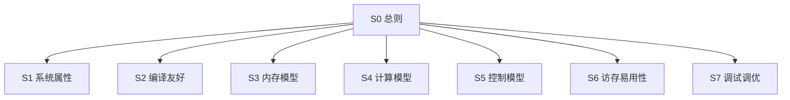

# 硬件易用性度量

> 一份文档，按硬件编程界面重整全部度量。
> 顶级目录：**系统属性 · 编译友好 · 内存模型 · 计算模型 · 控制模型 · 访存易用性 · 调试调优**。
> 标题即稳定 ID：H2 `S1`…`S7`，H3 `S1-D1`，H4 `S1-E1-eta_ov`。Cursor 大纲 / `@docs/next.md` 按标题解析。
> 原则：客观可复现（源码静态特征 + 硬件锚点）；三档性能（60% / 90% / 99%）驱动权重；数学公式表达。F1–F6 负载亲和只作度量项属性，不参与目录分层。

## 目录

文首只列章。每章下有 **度量项 → 度量子项** 目录。大纲：H2 章 · H3 度量项 · H4 度量子项。

- [S1 系统属性](#s1-系统属性)（10 度量项 / 18 度量子项）— 代际、配比、类型、互联等硬件规格与系统契约
- [S2 编译友好](#s2-编译友好)（6 度量项 / 6 度量子项）— 编译器/工具链能自动吸收多少微架构暴露
- [S3 内存模型](#s3-内存模型)（4 度量项 / 6 度量子项）— 层级、片上资源、一致性、初始化
- [S4 计算模型](#s4-计算模型)（4 度量项 / 8 度量子项）— 引擎、指令粒度、数值行为、API–指令耦合
- [S5 控制模型](#s5-控制模型)（3 度量项 / 7 度量子项）— 同步、流水序域、ID 协议
- [S6 访存易用性](#s6-访存易用性)（4 度量项 / 5 度量子项）— tiling、地址、对齐、随路搬运
- [S7 调试调优](#s7-调试调优)（5 度量项 / 16 度量子项）— 可观测、可重放、可隔离、可归因

## S0 总则

### S0-1 三层结构

| 层级 | 标题 | 稳定 ID | Cursor |
|---|---|---|---|
| **章节** | `## S1 系统属性` | `S1` | 大纲 H2 |
| **度量项** | `### S1-D1 源码跨代可移植性` | `S1-D1` | 大纲 H3 |
| **度量子项** | `#### S1-D1-eta_port 跨代零改动编译通过率` | `S1-D1-eta_port` | 大纲 H4 |

度量方案（AST / PMU / μ-bench / 故障注入）是子项上的提取方法，不是目录层级。
原建模维 A–E 是易用性税种，作为度量项属性保留。
标题里的 ASCII ID 供检索；`` 仅给经典预览 / GitHub 跳转，不是大纲节点。

### S0-2 七章与原分类的关系

| 章节 | 回答的问题 | 原 A–E / F1–F6 中迁入的主项 |
|---|---|---|
| S1 系统属性 | 硬件规格与代际契约是什么 | D1–D7、A8、B3、E1 |
| S2 编译友好 | 编译器能藏住多少暴露 | A7、A12–A16 |
| S3 内存模型 | 层级、容量、一致性如何暴露 | A1、A5、A6、A10 |
| S4 计算模型 | 计算引擎与指令如何表达 | B2、B7、A2、A4 |
| S5 控制模型 | 同步与序如何写 | A3、A9、A11 |
| S6 访存易用性 | 数据怎么搬、对齐、随路 | B1、B4、B5、B6 |
| S7 调试调优 | 能否看见、复现、隔离、归因 | C1–C5 |

一项只进一章。一行代码同时同步+搬移时按主目的归类：copy 上的隐式 sync 进 S5，copy 本身进 S6。

### S0-3 评分模型

四锚点归一化到 $[0,100]$：100 全自动、80 自动为主、60 手动可管理、0 完全手动。越小越好 / 越大越好按阈值分段（见下式）。

$$
s=
\begin{cases}
100,& x\le\tau_{100}\\
80,& \tau_{100}<x\le\tau_{80}\\
60,& \tau_{80}<x\le\tau_{60}\\
0,& x>\tau_{60}
\end{cases}
\quad\text{（越小越好；越大越好则不等式反向）}
$$

$$
S_{d,j}=\sum_k w_{d,j,k}\,s_{d,j,k},\quad
S_d=\sum_j W_{d,j}\,S_{d,j},\quad
U_p=\sum_d \Omega_{p,d}\,S_d
$$

三档权重 $\Omega_{p,d}$（A–E 税种，不随七章改）：

| $p$ | $\Omega_A$ | $\Omega_B$ | $\Omega_C$ | $\Omega_D$ | $\Omega_E$ |
|---|---|---|---|---|---|
| 60% | 0.182 | 0.227 | 0.136 | 0.068 | 0.182 |
| 90% | 0.367 | 0.286 | 0.094 | 0.080 | 0.137 |
| 99% | 0.342 | 0.213 | 0.139 | 0.108 | 0.197 |

红线不可加权补偿，任一不达标则 $U_p^{*}=\min(U_p,59)$：

| 红线 | 门槛 | 所在章 |
|---|---|---|
| B3 类型完备度 | 主流类型全覆盖 | S1 |
| C2 同输入一致率 | $100\%$ | S7 |
| C3 故障隔离 | 核级复位可用 | S7 |
| C4 错误遥测 / SDC | 覆盖 $\ge 80$，SDC $=0\%$ | S7 |

等级：S $\ge 90$，A $[80,90)$，B $[70,80)$，C $[60,70)$，D $<60$。

章得分（只用于短板定位，不替代 $U_p$）：

$$
S_{S_k}=\frac{\sum_{j\in S_k} W_j^{\mathrm{glob}} S_j}{\sum_{j\in S_k} W_j^{\mathrm{glob}}},\qquad W_j^{\mathrm{glob}}=\Omega_{d(j)}\,W_{d(j),j}
$$

弱亲和项（D2、D3、A12、A16）进 $S_{S_k}$ 时权乘 $0.5$。

### S0-4 负载亲和（属性，非目录）

隔离实验：只动一轴，看采集值谁变最大。F5≠F6（放得下 vs 搬得快），F3≠F4（小 batch 吃不满 vs 算术强度）。

| 亲和 | 隔离轴 | 命中信号 |
|---|---|---|
| F1 互联带宽 | 只改互联或 overlap | $T$ 变；同步/阻塞被触发 |
| F2 数据精度 | 只改精度档 | 正确性或可达性能档跳变 |
| F3 Batch 利用率 | 只改 batch | 效率从低到饱和上升 |
| F4 每 token FLOPs | 只改算力或 $F_{\mathrm{tok}}$ | $T$ 随算力/运算量变 |
| F5 显存容量 | 只加容量、带宽不变 | OOM 消失或去掉重计算 |
| F6 显存敏感 | 只改带宽或层级命中 | $T$ 近似随带宽线性变 |

## S1 系统属性

代际、配比、类型、互联等硬件规格与系统契约。

**本章目录**（10 度量项 / 18 度量子项）

- 度量项：[S1-D1 源码跨代可移植性](#s1-d1-源码跨代可移植性)
  - 度量子项：[`S1-D1-eta_port`](#s1-d1-eta_port-跨代零改动编译通过率) 跨代零改动编译通过率
  - 度量子项：[`S1-D1-eta_perf`](#s1-d1-eta_perf-跨代性能达成率) 跨代性能达成率
- 度量项：[S1-D2 API 破坏性变更（弱）](#s1-d2-api-破坏性变更弱) _弱_
  - 度量子项：[`S1-D2-n_brk`](#s1-d2-n_brk-每代-api-破坏性变更数) 每代 API 破坏性变更数
  - 度量子项：[`S1-D2-eta_brk`](#s1-d2-eta_brk-破坏性变更可检测率) 破坏性变更可检测率
- 度量项：[S1-D3 二进制兼容性（弱）](#s1-d3-二进制兼容性弱) _弱_
  - 度量子项：[`S1-D3-eta_load`](#s1-d3-eta_load-跨代可加载率) 跨代可加载率
- 度量项：[S1-D4 形态配比保持度](#s1-d4-形态配比保持度)
  - 度量子项：[`S1-D4-delta_ratio`](#s1-d4-delta_ratio-形态比变更幅度) 形态比变更幅度
  - 度量子项：[`S1-D4-rho_rw`](#s1-d4-rho_rw-算子重编写比例) 算子重编写比例
- 度量项：[S1-D5 算力配比冲击度](#s1-d5-算力配比冲击度)
  - 度量子项：[`S1-D5-delta_pow`](#s1-d5-delta_pow-配比变化幅度) 配比变化幅度
  - 度量子项：[`S1-D5-rho_retune`](#s1-d5-rho_retune-tiling流水重调比例) tiling/流水重调比例
- 度量项：[S1-D6 配比变化重写量](#s1-d6-配比变化重写量)
  - 度量子项：[`S1-D6-L_rw`](#s1-d6-l_rw-配比变化重写代码行) 配比变化重写代码行
- 度量项：[S1-D7 核映射自适应度](#s1-d7-核映射自适应度)
  - 度量子项：[`S1-D7-eta_nmap`](#s1-d7-eta_nmap-自动核映射命中率) 自动核映射命中率
- 度量项：[S1-A8 多版本一致性（补全）](#s1-a8-多版本一致性补全) _补全_
  - 度量子项：[`S1-A8-eta_ver`](#s1-a8-eta_ver-跨版本行为一致率) 跨版本行为一致率
  - 度量子项：[`S1-A8-n_drift`](#s1-a8-n_drift-跨版本语义漂移数) 跨版本语义漂移数
- 度量项：[S1-B3 数值/类型支持度（红线）](#s1-b3-数值类型支持度红线) _红线_
  - 度量子项：[`S1-B3-h_bar`](#s1-b3-h_bar-类型转换平均跳数) 类型转换平均跳数
  - 度量子项：[`S1-B3-eta_type`](#s1-b3-eta_type-类型完备度) 类型完备度
- 度量项：[S1-E1 通算 overlap 线性可叠加度](#s1-e1-通算-overlap-线性可叠加度)
  - 度量子项：[`S1-E1-eta_ov`](#s1-e1-eta_ov-overlap-场景占比) overlap 场景占比
  - 度量子项：[`S1-E1-eta_lin`](#s1-e1-eta_lin-叠加效率) 叠加效率
  - 度量子项：[`S1-E1-L_blk`](#s1-e1-l_blk-手工同步阻塞代码行) 手工同步阻塞代码行

### S1-D1 源码跨代可移植性

建模维 D · 项内权重 $W=0.34$ · 主/次亲和 F4 / 次 F3 · 路径 `S1-D1`

**度量子项**

- [`S1-D1-eta_port`](#s1-d1-eta_port-跨代零改动编译通过率) 跨代零改动编译通过率
- [`S1-D1-eta_perf`](#s1-d1-eta_perf-跨代性能达成率) 跨代性能达成率

**度量方案**：跨代源码编译通过率 + 性能达成率

#### S1-D1-eta_port 跨代零改动编译通过率

符号 $\eta_{port}$ · 方向：大越好 · 权重 $w=0.6$

| 锚点来源 | 计算方法 | 锚点阈值 |
|---|---|---|
| 跨代编译测试 | 零改动编译通过算子比例 | $\tau_{100}=100\%,\ \tau_{80}=80\%,\ \tau_{60}=50\%$ |

#### S1-D1-eta_perf 跨代性能达成率

符号 $\eta_{perf}$ · 方向：大越好 · 权重 $w=0.4$

| 锚点来源 | 计算方法 | 锚点阈值 |
|---|---|---|
| 跨代性能测试 | recompile 后性能/原代性能 | $\tau_{100}=100\%,\ \tau_{80}=90\%,\ \tau_{60}=70\%$ |

$$
S_{D,1} = 0.6\,s_{\eta_{port}} + 0.4\,s_{\eta_{perf}}
$$

### S1-D2 API 破坏性变更（弱）

建模维 D · 项内权重 $W=0.25$ · 主/次亲和 F2 · 路径 `S1-D2`

**度量子项**

- [`S1-D2-n_brk`](#s1-d2-n_brk-每代-api-破坏性变更数) 每代 API 破坏性变更数
- [`S1-D2-eta_brk`](#s1-d2-eta_brk-破坏性变更可检测率) 破坏性变更可检测率

**度量方案**：arch 版本间 API 签名/语义差异对比

#### S1-D2-n_brk 每代 API 破坏性变更数

符号 $n_{brk}$ · 方向：小越好 · 权重 $w=0.6$

| 锚点来源 | 计算方法 | 锚点阈值 |
|---|---|---|
| arch 版本对比 | 签名/语义破坏性变更数 | $\tau_{100}=0,\ \tau_{80}=5,\ \tau_{60}=20$ |

#### S1-D2-eta_brk 破坏性变更可检测率

符号 $\eta_{det}$ · 方向：大越好 · 权重 $w=0.4$

| 锚点来源 | 计算方法 | 锚点阈值 |
|---|---|---|
| 编译期检测 | 可编译期检测变更比例 | $\tau_{100}=100\%,\ \tau_{80}=80\%,\ \tau_{60}=50\%$ |

$$
S_{D,2} = 0.6\,s_{n_{brk}} + 0.4\,s_{\eta_{det}}
$$

### S1-D3 二进制兼容性（弱）

建模维 D · 项内权重 $W=0.16$ · 主/次亲和 F5 · 路径 `S1-D3`

**度量子项**

- [`S1-D3-eta_load`](#s1-d3-eta_load-跨代可加载率) 跨代可加载率

**度量方案**：已编译产物跨代加载测试

#### S1-D3-eta_load 跨代可加载率

符号 $\eta_{load}$ · 方向：大越好 · 权重 $w=1.0$

| 锚点来源 | 计算方法 | 锚点阈值 |
|---|---|---|
| 跨代加载测试 | 已编译算子跨代可加载比例 | $\tau_{100}=100\%,\ \tau_{80}=70\%,\ \tau_{60}=30\%$ |

$$
S_{D,3} = s_{\eta_{load}}
$$

### S1-D4 形态配比保持度

建模维 D · 项内权重 $W=0.09$ · 主/次亲和 F3 / 次 F5 · 路径 `S1-D4`

**度量子项**

- [`S1-D4-delta_ratio`](#s1-d4-delta_ratio-形态比变更幅度) 形态比变更幅度
- [`S1-D4-rho_rw`](#s1-d4-rho_rw-算子重编写比例) 算子重编写比例

**度量方案**：代际 AIC:AIV core 配比对比 + 算子重编写量

#### S1-D4-delta_ratio 形态比变更幅度

符号 $\Delta_{ratio}$ · 方向：小越好 · 权重 $w=0.5$

| 锚点来源 | 计算方法 | 锚点阈值 |
|---|---|---|
| 代际 target spec | AIC:AIV 比值变化幅度 | $\tau_{100}=0,\ \tau_{80}=0.5,\ \tau_{60}=2.0$ |

#### S1-D4-rho_rw 算子重编写比例

符号 $\rho_{rw}$ · 方向：小越好 · 权重 $w=0.5$

| 锚点来源 | 计算方法 | 锚点阈值 |
|---|---|---|
| 跨代算子对比 | 需重编写算子 / 总算子 | $\tau_{100}=0\%,\ \tau_{80}=10\%,\ \tau_{60}=30\%$ |

$$
S_{D,4} = 0.5\,s_{\Delta_{ratio}} + 0.5\,s_{\rho_{rw}}
$$

### S1-D5 算力配比冲击度

建模维 D · 项内权重 $W=0.09$ · 主/次亲和 F4 / 次 F3 · 路径 `S1-D5`

**度量子项**

- [`S1-D5-delta_pow`](#s1-d5-delta_pow-配比变化幅度) 配比变化幅度
- [`S1-D5-rho_retune`](#s1-d5-rho_retune-tiling流水重调比例) tiling/流水重调比例

**度量方案**：Cube:Vector:搬运算力配比对比 + tiling/流水重调比例

#### S1-D5-delta_pow 配比变化幅度

符号 $\Delta_{pow}$ · 方向：小越好 · 权重 $w=0.5$

| 锚点来源 | 计算方法 | 锚点阈值 |
|---|---|---|
| roofline 参数 | Cube:Vector:搬运配比变化 | $\tau_{100}=0,\ \tau_{80}=0.5,\ \tau_{60}=2.0$ |

#### S1-D5-rho_retune tiling/流水重调比例

符号 $\rho_{retune}$ · 方向：小越好 · 权重 $w=0.5$

| 锚点来源 | 计算方法 | 锚点阈值 |
|---|---|---|
| 跨代算子对比 | 需重调 tiling/流水算子比例 | $\tau_{100}=0\%,\ \tau_{80}=15\%,\ \tau_{60}=40\%$ |

$$
S_{D,5} = 0.5\,s_{\Delta_{pow}} + 0.5\,s_{\rho_{retune}}
$$

### S1-D6 配比变化重写量

建模维 D · 项内权重 $W=0.04$ · 主/次亲和 F3 / 次 F4 · 路径 `S1-D6`

**度量子项**

- [`S1-D6-L_rw`](#s1-d6-l_rw-配比变化重写代码行) 配比变化重写代码行

**度量方案**：源代码 diff 统计

#### S1-D6-L_rw 配比变化重写代码行

符号 $L_{rw}$ · 方向：小越好 · 权重 $w=1.0$

| 锚点来源 | 计算方法 | 锚点阈值 |
|---|---|---|
| 源代码 diff | 因配比变化需修改代码行数 | $\tau_{100}=0,\ \tau_{80}=50,\ \tau_{60}=200$ |

$$
S_{D,6} = s_{L_{rw}}
$$

### S1-D7 核映射自适应度

建模维 D · 项内权重 $W=0.03$ · 主/次亲和 F3 / 次 F1 · 路径 `S1-D7`

**度量子项**

- [`S1-D7-eta_nmap`](#s1-d7-eta_nmap-自动核映射命中率) 自动核映射命中率

**度量方案**：编译时自动核映射命中率统计

#### S1-D7-eta_nmap 自动核映射命中率

符号 $\eta_{map}$ · 方向：大越好 · 权重 $w=1.0$

| 锚点来源 | 计算方法 | 锚点阈值 |
|---|---|---|
| 编译时统计 | 据 target spec 自动选择核映射算子比例 | $\tau_{100}=100\%,\ \tau_{80}=70\%,\ \tau_{60}=40\%$ |

$$
S_{D,7} = s_{\eta_{map}}
$$

### S1-A8 多版本一致性（补全）

建模维 A · 项内权重 $W=0.04$ · 主/次亲和 F2 / 次 F4 · 路径 `S1-A8`

**度量子项**

- [`S1-A8-eta_ver`](#s1-a8-eta_ver-跨版本行为一致率) 跨版本行为一致率
- [`S1-A8-n_drift`](#s1-a8-n_drift-跨版本语义漂移数) 跨版本语义漂移数

**度量方案**：跨 arch 版本算子行为与语义 diff

#### S1-A8-eta_ver 跨版本行为一致率

符号 $\eta_{ver}$ · 方向：大越好 · 权重 $w=0.6$

| 锚点来源 | 计算方法 | 锚点阈值 |
|---|---|---|
| 跨版本对照 | 行为一致算子 / 总算子 | $\tau_{100}=100\%,\ \tau_{80}=80\%,\ \tau_{60}=50\%$ |

#### S1-A8-n_drift 跨版本语义漂移数

符号 $n_{drift}$ · 方向：小越好 · 权重 $w=0.4$

| 锚点来源 | 计算方法 | 锚点阈值 |
|---|---|---|
| arch 版本对比 | 语义漂移条目数 | $\tau_{100}=0,\ \tau_{80}=2,\ \tau_{60}=5$ |

$$
S_{A,8} = 0.6\,s_{\eta_{ver}} + 0.4\,s_{n_{drift}}
$$

### S1-B3 数值/类型支持度（红线）

建模维 B · 项内权重 $W=0.07$ · 主/次亲和 F2 · 路径 `S1-B3`

**度量子项**

- [`S1-B3-h_bar`](#s1-b3-h_bar-类型转换平均跳数) 类型转换平均跳数
- [`S1-B3-eta_type`](#s1-b3-eta_type-类型完备度) 类型完备度

**度量方案**：硬件类型支持矩阵 + 类型转换跳数二维表

#### S1-B3-h_bar 类型转换平均跳数

符号 $\bar{h}$ · 方向：小越好 · 权重 $w=0.6$

| 锚点来源 | 计算方法 | 锚点阈值 |
|---|---|---|
| 类型转换二维表 | 源类型→目标类型平均跳转指令数 | $\tau_{100}=0,\ \tau_{80}=1,\ \tau_{60}=3$ |

#### S1-B3-eta_type 类型完备度

符号 $\eta_{type}$ · 方向：大越好 · 权重 $w=0.4$

| 锚点来源 | 计算方法 | 锚点阈值 |
|---|---|---|
| 硬件类型矩阵 | 主流类型原生支持率 | $\tau_{100}=100\%,\ \tau_{80}=80\%,\ \tau_{60}=60\%$ |

$$
S_{B,3} = 0.6\,s_{\bar{h}} + 0.4\,s_{\eta_{type}}
$$

### S1-E1 通算 overlap 线性可叠加度

建模维 E · 项内权重 $W=1.00$ · 主/次亲和 F1 / 次 F4 · 路径 `S1-E1`

**度量子项**

- [`S1-E1-eta_ov`](#s1-e1-eta_ov-overlap-场景占比) overlap 场景占比
- [`S1-E1-eta_lin`](#s1-e1-eta_lin-叠加效率) 叠加效率
- [`S1-E1-L_blk`](#s1-e1-l_blk-手工同步阻塞代码行) 手工同步阻塞代码行

**度量方案**：通算 overlap 微基准对比 + 手工同步阻塞代码行统计

#### S1-E1-eta_ov overlap 场景占比

符号 $\eta_{ov}$ · 方向：大越好 · 权重 $w=0.4$

| 锚点来源 | 计算方法 | 锚点阈值 |
|---|---|---|
| μ-bench 对比 | $T_{total}\to\max(T_{comm},T_{comp})$ 的场景占比 | $\tau_{100}=100\%,\ \tau_{80}=80\%,\ \tau_{60}=50\%$ |

#### S1-E1-eta_lin 叠加效率

符号 $\eta_{lin}$ · 方向：大越好 · 权重 $w=0.4$

| 锚点来源 | 计算方法 | 锚点阈值 |
|---|---|---|
| μ-bench 对比 | $(T_{comm}+T_{comp}-T_{total})/\min(T_{comm},T_{comp})$ | $\tau_{100}=1.0,\ \tau_{80}=0.8,\ \tau_{60}=0.5$ |

#### S1-E1-L_blk 手工同步阻塞代码行

符号 $L_{blk}$ · 方向：小越好 · 权重 $w=0.2$

| 锚点来源 | 计算方法 | 锚点阈值 |
|---|---|---|
| 源代码统计 | 手工 SetFlag 阻塞叠加代码行 | $\tau_{100}=0,\ \tau_{80}=3,\ \tau_{60}=10$ |

$$
S_{E,1} = 0.4\,s_{\eta_{ov}} + 0.4\,s_{\eta_{lin}} + 0.2\,s_{L_{blk}}
$$

> 叠加效率 $\eta_{lin}=(T_{comm}+T_{comp}-T_{total})/\min(T_{comm},T_{comp})$。

**Bench**：AllReduce 通信 + 反向计算 overlap；对照 CUDA NCCL

## S2 编译友好

编译器/工具链能自动吸收多少微架构暴露。

**本章目录**（6 度量项 / 6 度量子项）

- 度量项：[S2-A7 编译友好屏蔽率](#s2-a7-编译友好屏蔽率)
  - 度量子项：[`S2-A7-eta_sh`](#s2-a7-eta_sh-编译友好屏蔽率) 编译友好屏蔽率
- 度量项：[S2-A13 自动同步消除率（补全）](#s2-a13-自动同步消除率补全) _补全_
  - 度量子项：[`S2-A13-eta_sync`](#s2-a13-eta_sync-自动同步消除率) 自动同步消除率
- 度量项：[S2-A14 自动 tiling 命中率（补全）](#s2-a14-自动-tiling-命中率补全) _补全_
  - 度量子项：[`S2-A14-eta_til`](#s2-a14-eta_til-自动-tiling-命中率) 自动 tiling 命中率
- 度量项：[S2-A15 自动格式转换覆盖率（补全）](#s2-a15-自动格式转换覆盖率补全) _补全_
  - 度量子项：[`S2-A15-eta_fmt`](#s2-a15-eta_fmt-自动格式转换覆盖率) 自动格式转换覆盖率
- 度量项：[S2-A12 高层 API 替代覆盖率（弱 · 补全）](#s2-a12-高层-api-替代覆盖率弱-补全) _弱 · 补全_
  - 度量子项：[`S2-A12-eta_hl`](#s2-a12-eta_hl-高层-api-覆盖率) 高层 API 覆盖率
- 度量项：[S2-A16 用户实际感知暴露度（弱 · 补全）](#s2-a16-用户实际感知暴露度弱-补全) _弱 · 补全_
  - 度量子项：[`S2-A16-n_perc`](#s2-a16-n_perc-用户须感知暴露项数) 用户须感知暴露项数

### S2-A7 编译友好屏蔽率

建模维 A · 项内权重 $W=0.10$ · 主/次亲和 F3 / 次 F1 · 路径 `S2-A7`

**度量子项**

- [`S2-A7-eta_sh`](#s2-a7-eta_sh-编译友好屏蔽率) 编译友好屏蔽率

**度量方案**：编译时/AscendC 自动消化覆盖率统计

#### S2-A7-eta_sh 编译友好屏蔽率

符号 $\eta_{sh}$ · 方向：大越好 · 权重 $w=1.0$

| 锚点来源 | 计算方法 | 锚点阈值 |
|---|---|---|
| 编译时统计 | A1–A6 暴露被自动屏蔽比例 | $\tau_{100}=100\%,\ \tau_{80}=70\%,\ \tau_{60}=40\%$ |

$$
S_{A,7} = s_{\eta_{sh}}
$$

> 原合式含 $\eta_{sync}/\eta_{til}/\eta_{fmt}$，已拆到 A13/A14/A15，本项只计屏蔽率。

### S2-A13 自动同步消除率（补全）

建模维 A · 项内权重 $W=0.05$ · 主/次亲和 F1 / 次 F4 · 路径 `S2-A13`

**度量子项**

- [`S2-A13-eta_sync`](#s2-a13-eta_sync-自动同步消除率) 自动同步消除率

**度量方案**：编译时自动插入/消除同步覆盖率

#### S2-A13-eta_sync 自动同步消除率

符号 $\eta_{sync}$ · 方向：大越好 · 权重 $w=1.0$

| 锚点来源 | 计算方法 | 锚点阈值 |
|---|---|---|
| 编译时统计 | 自动插入同步覆盖算子比例 | $\tau_{100}=100\%,\ \tau_{80}=80\%,\ \tau_{60}=50\%$ |

$$
S_{A,13} = s_{\eta_{sync}}
$$

### S2-A14 自动 tiling 命中率（补全）

建模维 A · 项内权重 $W=0.04$ · 主/次亲和 F3 / 次 F4 · 路径 `S2-A14`

**度量子项**

- [`S2-A14-eta_til`](#s2-a14-eta_til-自动-tiling-命中率) 自动 tiling 命中率

**度量方案**：autotuning 搜索命中统计

#### S2-A14-eta_til 自动 tiling 命中率

符号 $\eta_{til}$ · 方向：大越好 · 权重 $w=1.0$

| 锚点来源 | 计算方法 | 锚点阈值 |
|---|---|---|
| autotuning 统计 | 自动搜索 tiling 命中算子比例 | $\tau_{100}=100\%,\ \tau_{80}=70\%,\ \tau_{60}=40\%$ |

$$
S_{A,14} = s_{\eta_{til}}
$$

### S2-A15 自动格式转换覆盖率（补全）

建模维 A · 项内权重 $W=0.02$ · 主/次亲和 F2 / 次 F6 · 路径 `S2-A15`

**度量子项**

- [`S2-A15-eta_fmt`](#s2-a15-eta_fmt-自动格式转换覆盖率) 自动格式转换覆盖率

**度量方案**：编译时 dn2nz/nd2nz/dtype 自动转换覆盖统计

#### S2-A15-eta_fmt 自动格式转换覆盖率

符号 $\eta_{fmt}$ · 方向：大越好 · 权重 $w=1.0$

| 锚点来源 | 计算方法 | 锚点阈值 |
|---|---|---|
| 编译时统计 | 自动 dn2nz/nd2nz 覆盖算子比例 | $\tau_{100}=100\%,\ \tau_{80}=70\%,\ \tau_{60}=40\%$ |

$$
S_{A,15} = s_{\eta_{fmt}}
$$

### S2-A12 高层 API 替代覆盖率（弱 · 补全）

建模维 A · 项内权重 $W=0.05$ · 主/次亲和 F3 · 路径 `S2-A12`

**度量子项**

- [`S2-A12-eta_hl`](#s2-a12-eta_hl-高层-api-覆盖率) 高层 API 覆盖率

**度量方案**：高层 API 可替换手写 tiling/搬运的算子覆盖统计

#### S2-A12-eta_hl 高层 API 覆盖率

符号 $\eta_{hl}$ · 方向：大越好 · 权重 $w=1.0$

| 锚点来源 | 计算方法 | 锚点阈值 |
|---|---|---|
| 工具链统计 | 可被高层 API 替代的算子比例 | $\tau_{100}=100\%,\ \tau_{80}=70\%,\ \tau_{60}=40\%$ |

$$
S_{A,12} = s_{\eta_{hl}}
$$

### S2-A16 用户实际感知暴露度（弱 · 补全）

建模维 A · 项内权重 $W=0.02$ · 主/次亲和 F4 · 路径 `S2-A16`

**度量子项**

- [`S2-A16-n_perc`](#s2-a16-n_perc-用户须感知暴露项数) 用户须感知暴露项数

**度量方案**：用户须显式配置的微架构暴露项计数

#### S2-A16-n_perc 用户须感知暴露项数

符号 $n_{perc}$ · 方向：小越好 · 权重 $w=1.0$

| 锚点来源 | 计算方法 | 锚点阈值 |
|---|---|---|
| API/文档暴露清单 | 用户必须填写的微架构参数个数 | $\tau_{100}=0,\ \tau_{80}=3,\ \tau_{60}=8$ |

$$
S_{A,16} = s_{n_{perc}}
$$

## S3 内存模型

层级、片上资源、一致性、初始化。

**本章目录**（4 度量项 / 6 度量子项）

- 度量项：[S3-A1 内存层级暴露](#s3-a1-内存层级暴露)
  - 度量子项：[`S3-A1-deltaK`](#s3-a1-deltak-tiling-key-增长量) Tiling Key 增长量
  - 度量子项：[`S3-A1-r_mv`](#s3-a1-r_mv-搬运代码行占比) 搬运代码行占比
- 度量项：[S3-A5 资源/约束暴露](#s3-a5-资源约束暴露)
  - 度量子项：[`S3-A5-L_mm`](#s3-a5-l_mm-内存管理代码行) 内存管理代码行
  - 度量子项：[`S3-A5-L_id`](#s3-a5-l_id-id-管理代码行) ID 管理代码行
- 度量项：[S3-A6 硬件约束暴露（DCCI）](#s3-a6-硬件约束暴露dcci)
  - 度量子项：[`S3-A6-L_dcci`](#s3-a6-l_dcci-dcci-代码行) DCCI 代码行
- 度量项：[S3-A10 设备初始化（补全）](#s3-a10-设备初始化补全) _补全_
  - 度量子项：[`S3-A10-L_init`](#s3-a10-l_init-设备初始化代码行) 设备初始化代码行

### S3-A1 内存层级暴露

建模维 A · 项内权重 $W=0.12$ · 主/次亲和 F6 / 次 F5 · 路径 `S3-A1`

**度量子项**

- [`S3-A1-deltaK`](#s3-a1-deltak-tiling-key-增长量) Tiling Key 增长量
- [`S3-A1-r_mv`](#s3-a1-r_mv-搬运代码行占比) 搬运代码行占比

**度量方案**：源代码 AST 扫描 + 硬件内存层级规格解析

#### S3-A1-deltaK Tiling Key 增长量

符号 $\Delta K$ · 方向：小越好 · 权重 $w=0.5$

| 锚点来源 | 计算方法 | 锚点阈值 |
|---|---|---|
| Tiling 参数扫描 | 每新增一层内存层级，Tiling Key 增加个数 | $\tau_{100}=0,\ \tau_{80}=2,\ \tau_{60}=5$ |

#### S3-A1-r_mv 搬运代码行占比

符号 $r_{mv}$ · 方向：小越好 · 权重 $w=0.5$

| 锚点来源 | 计算方法 | 锚点阈值 |
|---|---|---|
| 源代码统计 | 搬运代码行 / 算子总代码行 | $\tau_{100}=5\%,\ \tau_{80}=15\%,\ \tau_{60}=30\%$ |

$$
S_{A,1} = 0.5\,s_{\Delta K} + 0.5\,s_{r_{mv}}
$$

**Bench**：Gelu vs Gelu_Reg；Softmax（GM+UB）vs Matmul（6 层）

### S3-A5 资源/约束暴露

建模维 A · 项内权重 $W=0.04$ · 主/次亲和 F5 / 次 F3 · 路径 `S3-A5`

**度量子项**

- [`S3-A5-L_mm`](#s3-a5-l_mm-内存管理代码行) 内存管理代码行
- [`S3-A5-L_id`](#s3-a5-l_id-id-管理代码行) ID 管理代码行

**度量方案**：源代码 buffer/ID 管理代码统计 + 硬件 ID 种类

#### S3-A5-L_mm 内存管理代码行

符号 $L_{mm}$ · 方向：小越好 · 权重 $w=0.625$

| 锚点来源 | 计算方法 | 锚点阈值 |
|---|---|---|
| 源代码统计 | UB/L1/L0 分配与地址计算代码行 | $\tau_{100}=0,\ \tau_{80}=20,\ \tau_{60}=50$ |

#### S3-A5-L_id ID 管理代码行

符号 $L_{id}$ · 方向：小越好 · 权重 $w=0.375$

| 锚点来源 | 计算方法 | 锚点阈值 |
|---|---|---|
| 源代码统计 | block_idx/同步 ID 管理代码行 | $\tau_{100}=0,\ \tau_{80}=10,\ \tau_{60}=30$ |

$$
S_{A,5} = (0.5\,s_{L_{mm}} + 0.3\,s_{L_{id}})/0.8
$$

> $L_{init}$ 已拆到 A10，本项对剩余两子项重归一。

### S3-A6 硬件约束暴露（DCCI）

建模维 A · 项内权重 $W=0.04$ · 主/次亲和 F6 / 次 F1 · 路径 `S3-A6`

**度量子项**

- [`S3-A6-L_dcci`](#s3-a6-l_dcci-dcci-代码行) DCCI 代码行

**度量方案**：源代码 DCCI 代码统计 + 硬件一致性机制

#### S3-A6-L_dcci DCCI 代码行

符号 $L_{dcci}$ · 方向：小越好 · 权重 $w=1.0$

| 锚点来源 | 计算方法 | 锚点阈值 |
|---|---|---|
| 源代码统计 | 预取/无效化/同步代码行 | $\tau_{100}=0,\ \tau_{80}=10,\ \tau_{60}=30$ |

$$
S_{A,6} = s_{L_{dcci}}
$$

> $L_{cancel}$ 已拆到 A11。

### S3-A10 设备初始化（补全）

建模维 A · 项内权重 $W=0.02$ · 主/次亲和 F5 · 路径 `S3-A10`

**度量子项**

- [`S3-A10-L_init`](#s3-a10-l_init-设备初始化代码行) 设备初始化代码行

**度量方案**：AIC/AIV 操作单元初始化代码统计

#### S3-A10-L_init 设备初始化代码行

符号 $L_{init}$ · 方向：小越好 · 权重 $w=1.0$

| 锚点来源 | 计算方法 | 锚点阈值 |
|---|---|---|
| 源代码统计 | AIC/AIV 操作单元初始化代码行 | $\tau_{100}=0,\ \tau_{80}=10,\ \tau_{60}=30$ |

$$
S_{A,10} = s_{L_{init}}
$$

## S4 计算模型

引擎、指令粒度、数值行为、API–指令耦合。

**本章目录**（4 度量项 / 8 度量子项）

- 度量项：[S4-B2 计算复杂度](#s4-b2-计算复杂度)
  - 度量子项：[`S4-B2-rho_ins`](#s4-b2-rho_ins-指令粒度比) 指令粒度比
- 度量项：[S4-B7 计算行为表达（补全）](#s4-b7-计算行为表达补全) _补全_
  - 度量子项：[`S4-B7-n_beh`](#s4-b7-n_beh-显式饱和舍入特殊函数调用数) 显式饱和/舍入/特殊函数调用数
- 度量项：[S4-A2 多流水暴露](#s4-a2-多流水暴露)
  - 度量子项：[`S4-A2-r_sw`](#s4-a2-r_sw-pipeline-切换手动同步代码占比) Pipeline 切换手动同步代码占比
  - 度量子项：[`S4-A2-eta_auto`](#s4-a2-eta_auto-自动同步覆盖率) 自动同步覆盖率
  - 度量子项：[`S4-A2-n_VF`](#s4-a2-n_vf-vf-表达数) VF 表达数
- 度量项：[S4-A4 API-指令耦合](#s4-a4-api-指令耦合)
  - 度量子项：[`S4-A4-p_bar`](#s4-a4-p_bar-入参平均数) 入参平均数
  - 度量子项：[`S4-A4-n_reg`](#s4-a4-n_reg-寄存器配置数) 寄存器配置数
  - 度量子项：[`S4-A4-delta_sig`](#s4-a4-delta_sig-跨版本签名差异数) 跨版本签名差异数

### S4-B2 计算复杂度

建模维 B · 项内权重 $W=0.13$ · 主/次亲和 F4 · 路径 `S4-B2`

**度量子项**

- [`S4-B2-rho_ins`](#s4-b2-rho_ins-指令粒度比) 指令粒度比

**度量方案**：CCEC 指令数 vs CUDA PTX 指令数对比

#### S4-B2-rho_ins 指令粒度比

符号 $\rho_{ins}$ · 方向：小越好 · 权重 $w=1.0$

| 锚点来源 | 计算方法 | 锚点阈值 |
|---|---|---|
| CCEC vs PTX | CCEC 指令数 / PTX 指令数 | $\tau_{100}=1.0,\ \tau_{80}=1.5,\ \tau_{60}=3.0$ |

$$
S_{B,2} = s_{\rho_{ins}}
$$

### S4-B7 计算行为表达（补全）

建模维 B · 项内权重 $W=0.04$ · 主/次亲和 F4 / 次 F2 · 路径 `S4-B7`

**度量子项**

- [`S4-B7-n_beh`](#s4-b7-n_beh-显式饱和舍入特殊函数调用数) 显式饱和/舍入/特殊函数调用数

**度量方案**：饱和 / 舍入 / 特殊函数显式调用扫描

#### S4-B7-n_beh 显式饱和/舍入/特殊函数调用数

符号 $n_{beh}$ · 方向：小越好 · 权重 $w=1.0$

| 锚点来源 | 计算方法 | 锚点阈值 |
|---|---|---|
| 源代码统计 | 须手写的数值行为插桩次数 | $\tau_{100}=0,\ \tau_{80}=2,\ \tau_{60}=6$ |

$$
S_{B,7} = s_{n_{beh}}
$$

### S4-A2 多流水暴露

建模维 A · 项内权重 $W=0.08$ · 主/次亲和 F4 / 次 F1 · 路径 `S4-A2`

**度量子项**

- [`S4-A2-r_sw`](#s4-a2-r_sw-pipeline-切换手动同步代码占比) Pipeline 切换手动同步代码占比
- [`S4-A2-eta_auto`](#s4-a2-eta_auto-自动同步覆盖率) 自动同步覆盖率
- [`S4-A2-n_VF`](#s4-a2-n_vf-vf-表达数) VF 表达数

**度量方案**：源代码 SetFlag/WaitFlag 调用统计 + 硬件流水引擎数

#### S4-A2-r_sw Pipeline 切换手动同步代码占比

符号 $r_{sw}$ · 方向：小越好 · 权重 $w=0.5$

| 锚点来源 | 计算方法 | 锚点阈值 |
|---|---|---|
| 源代码统计 | SetFlag/WaitFlag 代码行 / 总代码行 | $\tau_{100}=0\%,\ \tau_{80}=5\%,\ \tau_{60}=15\%$ |

#### S4-A2-eta_auto 自动同步覆盖率

符号 $\eta_{auto}$ · 方向：大越好 · 权重 $w=0.3$

| 锚点来源 | 计算方法 | 锚点阈值 |
|---|---|---|
| 编译时统计 | 自动插入同步覆盖算子比例 | $\tau_{100}=100\%,\ \tau_{80}=80\%,\ \tau_{60}=50\%$ |

#### S4-A2-n_VF VF 表达数

符号 $n_{VF}$ · 方向：小越好 · 权重 $w=0.2$

| 锚点来源 | 计算方法 | 锚点阈值 |
|---|---|---|
| 源代码统计 | 单算子需编写的 VF 个数 | $\tau_{100}=1,\ \tau_{80}=2,\ \tau_{60}=4$ |

$$
S_{A,2} = 0.5\,s_{r_{sw}} + 0.3\,s_{\eta_{auto}} + 0.2\,s_{n_{VF}}
$$

**Bench**：Softmax（两阶段）/ Matmul（三阶段）/ Conv2D（多阶段）

### S4-A4 API-指令耦合

建模维 A · 项内权重 $W=0.08$ · 主/次亲和 F4 / 次 F2 · 路径 `S4-A4`

**度量子项**

- [`S4-A4-p_bar`](#s4-a4-p_bar-入参平均数) 入参平均数
- [`S4-A4-n_reg`](#s4-a4-n_reg-寄存器配置数) 寄存器配置数
- [`S4-A4-delta_sig`](#s4-a4-delta_sig-跨版本签名差异数) 跨版本签名差异数

**度量方案**：源代码 API 签名解析 + 硬件寄存器配置数

#### S4-A4-p_bar 入参平均数

符号 $\bar{p}$ · 方向：小越好 · 权重 $w=0.4$

| 锚点来源 | 计算方法 | 锚点阈值 |
|---|---|---|
| 源代码 API 签名 | 分类平均参数数量 | $\tau_{100}=2,\ \tau_{80}=5,\ \tau_{60}=10$ |

#### S4-A4-n_reg 寄存器配置数

符号 $n_{reg}$ · 方向：小越好 · 权重 $w=0.4$

| 锚点来源 | 计算方法 | 锚点阈值 |
|---|---|---|
| 硬件寄存器映射 | 单指令需显式配置的寄存器数 | $\tau_{100}=0,\ \tau_{80}=3,\ \tau_{60}=10$ |

#### S4-A4-delta_sig 跨版本签名差异数

符号 $\Delta_{sig}$ · 方向：小越好 · 权重 $w=0.2$

| 锚点来源 | 计算方法 | 锚点阈值 |
|---|---|---|
| arch 版本对比 | API 签名差异数 | $\tau_{100}=0,\ \tau_{80}=2,\ \tau_{60}=5$ |

$$
S_{A,4} = 0.4\,s_{\bar{p}} + 0.4\,s_{n_{reg}} + 0.2\,s_{\Delta_{sig}}
$$

**Bench**：asc_copy_gm2ub / asc_copy_l0c2gm（20+ 参数）

## S5 控制模型

同步、流水序域、ID 协议。

**本章目录**（3 度量项 / 7 度量子项）

- 度量项：[S5-A3 同步暴露](#s5-a3-同步暴露)
  - 度量子项：[`S5-A3-n_intra`](#s5-a3-n_intra-核内同步调用数) 核内同步调用数
  - 度量子项：[`S5-A3-n_inter`](#s5-a3-n_inter-核间同步调用数) 核间同步调用数
  - 度量子项：[`S5-A3-eta_xcore`](#s5-a3-eta_xcore-自动核间同步覆盖率) 自动核间同步覆盖率
- 度量项：[S5-A9 同步流水复杂度（补全）](#s5-a9-同步流水复杂度补全) _补全_
  - 度量子项：[`S5-A9-n_pipe`](#s5-a9-n_pipe-流水级数) 流水级数
  - 度量子项：[`S5-A9-n_ord`](#s5-a9-n_ord-序域个数) 序域个数
- 度量项：[S5-A11 ID 残留对消（补全）](#s5-a11-id-残留对消补全) _补全_
  - 度量子项：[`S5-A11-L_cancel`](#s5-a11-l_cancel-id-对消代码行) ID 对消代码行
  - 度量子项：[`S5-A11-n_resid`](#s5-a11-n_resid-对消后残留次数) 对消后残留次数

### S5-A3 同步暴露

建模维 A · 项内权重 $W=0.10$ · 主/次亲和 F1 / 次 F4 · 路径 `S5-A3`

**度量子项**

- [`S5-A3-n_intra`](#s5-a3-n_intra-核内同步调用数) 核内同步调用数
- [`S5-A3-n_inter`](#s5-a3-n_inter-核间同步调用数) 核间同步调用数
- [`S5-A3-eta_xcore`](#s5-a3-eta_xcore-自动核间同步覆盖率) 自动核间同步覆盖率

**度量方案**：源代码同步调用统计 + 硬件 CrossCore 同步原语

#### S5-A3-n_intra 核内同步调用数

符号 $n_{intra}$ · 方向：小越好 · 权重 $w=0.4$

| 锚点来源 | 计算方法 | 锚点阈值 |
|---|---|---|
| 源代码统计 | 单算子 SetFlag/WaitFlag 调用次数 | $\tau_{100}=0,\ \tau_{80}=3,\ \tau_{60}=8$ |

#### S5-A3-n_inter 核间同步调用数

符号 $n_{inter}$ · 方向：小越好 · 权重 $w=0.4$

| 锚点来源 | 计算方法 | 锚点阈值 |
|---|---|---|
| 源代码统计 | CrossCore SetFlag/WaitFlag 次数 | $\tau_{100}=0,\ \tau_{80}=2,\ \tau_{60}=6$ |

#### S5-A3-eta_xcore 自动核间同步覆盖率

符号 $\eta_{xcore}$ · 方向：大越好 · 权重 $w=0.2$

| 锚点来源 | 计算方法 | 锚点阈值 |
|---|---|---|
| 编译时统计 | 自动核间同步覆盖算子比例 | $\tau_{100}=100\%,\ \tau_{80}=70\%,\ \tau_{60}=40\%$ |

$$
S_{A,3} = 0.4\,s_{n_{intra}} + 0.4\,s_{n_{inter}} + 0.2\,s_{\eta_{xcore}}
$$

**Bench**：Softmax/Matmul 算子级同步；多核 AllReduce CrossCore 同步

### S5-A9 同步流水复杂度（补全）

建模维 A · 项内权重 $W=0.04$ · 主/次亲和 F1 / 次 F4 · 路径 `S5-A9`

**度量子项**

- [`S5-A9-n_pipe`](#s5-a9-n_pipe-流水级数) 流水级数
- [`S5-A9-n_ord`](#s5-a9-n_ord-序域个数) 序域个数

**度量方案**：源代码流水阶段数 + 必须同时记住的序域统计

#### S5-A9-n_pipe 流水级数

符号 $n_{pipe}$ · 方向：小越好 · 权重 $w=0.5$

| 锚点来源 | 计算方法 | 锚点阈值 |
|---|---|---|
| 源代码阶段划分 | 单算子手动流水阶段数 | $\tau_{100}=1,\ \tau_{80}=3,\ \tau_{60}=6$ |

#### S5-A9-n_ord 序域个数

符号 $n_{ord}$ · 方向：小越好 · 权重 $w=0.5$

| 锚点来源 | 计算方法 | 锚点阈值 |
|---|---|---|
| 同步原语扫描 | 须同时记住的序域（核内/核间/Host）个数 | $\tau_{100}=1,\ \tau_{80}=2,\ \tau_{60}=4$ |

$$
S_{A,9} = 0.5\,s_{n_{pipe}} + 0.5\,s_{n_{ord}}
$$

### S5-A11 ID 残留对消（补全）

建模维 A · 项内权重 $W=0.02$ · 主/次亲和 F1 · 路径 `S5-A11`

**度量子项**

- [`S5-A11-L_cancel`](#s5-a11-l_cancel-id-对消代码行) ID 对消代码行
- [`S5-A11-n_resid`](#s5-a11-n_resid-对消后残留次数) 对消后残留次数

**度量方案**：GetBlockIdx 消歧与残留扫描

#### S5-A11-L_cancel ID 对消代码行

符号 $L_{cancel}$ · 方向：小越好 · 权重 $w=0.6$

| 锚点来源 | 计算方法 | 锚点阈值 |
|---|---|---|
| 源代码统计 | GetBlockIdx 消歧代码行 | $\tau_{100}=0,\ \tau_{80}=5,\ \tau_{60}=15$ |

#### S5-A11-n_resid 对消后残留次数

符号 $n_{resid}$ · 方向：小越好 · 权重 $w=0.4$

| 锚点来源 | 计算方法 | 锚点阈值 |
|---|---|---|
| 运行时 ID 扫描 | 同步 ID 残留次数 | $\tau_{100}=0,\ \tau_{80}=1,\ \tau_{60}=3$ |

$$
S_{A,11} = 0.6\,s_{L_{cancel}} + 0.4\,s_{n_{resid}}
$$

## S6 访存易用性

tiling、地址、对齐、随路搬运。

**本章目录**（4 度量项 / 5 度量子项）

- 度量项：[S6-B1 搬运复杂度（tiling）](#s6-b1-搬运复杂度tiling)
  - 度量子项：[`S6-B1-n_til`](#s6-b1-n_til-tiling-参数个数) Tiling 参数个数
- 度量项：[S6-B4 地址计算（补全）](#s6-b4-地址计算补全) _补全_
  - 度量子项：[`S6-B4-L_addr`](#s6-b4-l_addr-地址计算代码行) 地址计算代码行
- 度量项：[S6-B5 地址对齐（补全）](#s6-b5-地址对齐补全) _补全_
  - 度量子项：[`S6-B5-n_pad`](#s6-b5-n_pad-对齐边界分支数) 对齐边界分支数
- 度量项：[S6-B6 随路搬运（补全）](#s6-b6-随路搬运补全) _补全_
  - 度量子项：[`S6-B6-n_fix`](#s6-b6-n_fix-随路互斥拆分步数) 随路互斥拆分步数
  - 度量子项：[`S6-B6-n_fmt`](#s6-b6-n_fmt-格式转换调用数) 格式转换调用数

### S6-B1 搬运复杂度（tiling）

建模维 B · 项内权重 $W=0.33$ · 主/次亲和 F3 / 次 F6 · 路径 `S6-B1`

**度量子项**

- [`S6-B1-n_til`](#s6-b1-n_til-tiling-参数个数) Tiling 参数个数

**度量方案**：源代码 Tiling 参数统计

#### S6-B1-n_til Tiling 参数个数

符号 $n_{til}$ · 方向：小越好 · 权重 $w=1.0$

| 锚点来源 | 计算方法 | 锚点阈值 |
|---|---|---|
| 源代码统计 | block_dim/tile_len_M/N/K 参数数 | $\tau_{100}=2,\ \tau_{80}=6,\ \tau_{60}=12$ |

$$
S_{B,1} = s_{n_{til}}
$$

> 地址/对齐/随路已拆到 B4/B5/B6，本项只计 tiling 参数。

**Bench**：Matmul / Conv2D（im2col 后 tile）/ Embedding

### S6-B4 地址计算（补全）

建模维 B · 项内权重 $W=0.17$ · 主/次亲和 F6 / 次 F5 · 路径 `S6-B4`

**度量子项**

- [`S6-B4-L_addr`](#s6-b4-l_addr-地址计算代码行) 地址计算代码行

**度量方案**：多级内存地址偏移代码统计（从 B1 拆出）

#### S6-B4-L_addr 地址计算代码行

符号 $L_{addr}$ · 方向：小越好 · 权重 $w=1.0$

| 锚点来源 | 计算方法 | 锚点阈值 |
|---|---|---|
| 源代码统计 | 地址偏移计算代码行 | $\tau_{100}=0,\ \tau_{80}=20,\ \tau_{60}=50$ |

$$
S_{B,4} = s_{L_{addr}}
$$

### S6-B5 地址对齐（补全）

建模维 B · 项内权重 $W=0.13$ · 主/次亲和 F6 / 次 F3 · 路径 `S6-B5`

**度量子项**

- [`S6-B5-n_pad`](#s6-b5-n_pad-对齐边界分支数) 对齐边界分支数

**度量方案**：padding / 对齐边界分支统计（从 B1 拆出）

#### S6-B5-n_pad 对齐边界分支数

符号 $n_{pad}$ · 方向：小越好 · 权重 $w=1.0$

| 锚点来源 | 计算方法 | 锚点阈值 |
|---|---|---|
| 源代码统计 | padding/边界分支数 | $\tau_{100}=0,\ \tau_{80}=3,\ \tau_{60}=8$ |

$$
S_{B,5} = s_{n_{pad}}
$$

### S6-B6 随路搬运（补全）

建模维 B · 项内权重 $W=0.13$ · 主/次亲和 F2 / 次 F6 · 路径 `S6-B6`

**度量子项**

- [`S6-B6-n_fix`](#s6-b6-n_fix-随路互斥拆分步数) 随路互斥拆分步数
- [`S6-B6-n_fmt`](#s6-b6-n_fmt-格式转换调用数) 格式转换调用数

**度量方案**：FIXPIPE 随路互斥表 + 格式转换调用统计（从 B1 拆出）

#### S6-B6-n_fix 随路互斥拆分步数

符号 $n_{fix}$ · 方向：小越好 · 权重 $w=0.6$

| 锚点来源 | 计算方法 | 锚点阈值 |
|---|---|---|
| 硬件 FIXPIPE 互斥表 | 互斥随路组合需拆分步数 | $\tau_{100}=0,\ \tau_{80}=2,\ \tau_{60}=5$ |

#### S6-B6-n_fmt 格式转换调用数

符号 $n_{fmt}$ · 方向：小越好 · 权重 $w=0.4$

| 锚点来源 | 计算方法 | 锚点阈值 |
|---|---|---|
| 源代码统计 | dn2nz/nd2nz 调用次数 | $\tau_{100}=0,\ \tau_{80}=2,\ \tau_{60}=5$ |

$$
S_{B,6} = 0.6\,s_{n_{fix}} + 0.4\,s_{n_{fmt}}
$$

## S7 调试调优

可观测、可重放、可隔离、可归因。

**本章目录**（5 度量项 / 16 度量子项）

- 度量项：[S7-C1 性能度量覆盖](#s7-c1-性能度量覆盖)
  - 度量子项：[`S7-C1-eta_evt`](#s7-c1-eta_evt-关键性能事件覆盖率) 关键性能事件覆盖率
  - 度量子项：[`S7-C1-eps_met`](#s7-c1-eps_met-指标相对误差) 指标相对误差
  - 度量子项：[`S7-C1-rho_loss`](#s7-c1-rho_loss-数据丢失率) 数据丢失率
  - 度量子项：[`S7-C1-eta_stall`](#s7-c1-eta_stall-stall-原因解释覆盖率) Stall 原因解释覆盖率
- 度量项：[S7-C2 确定性与重放（红线）](#s7-c2-确定性与重放红线) _红线_
  - 度量子项：[`S7-C2-eta_det`](#s7-c2-eta_det-同输入结果一致率) 同输入结果一致率
  - 度量子项：[`S7-C2-eta_rep`](#s7-c2-eta_rep-执行顺序可重放率) 执行顺序可重放率
- 度量项：[S7-C3 故障隔离与恢复（红线）](#s7-c3-故障隔离与恢复红线) _红线_
  - 度量子项：[`S7-C3-g_rst`](#s7-c3-g_rst-最小复位范围) 最小复位范围
  - 度量子项：[`S7-C3-eta_rst`](#s7-c3-eta_rst-局部复位成功率) 局部复位成功率
  - 度量子项：[`S7-C3-MTTR`](#s7-c3-mttr-平均恢复时间) 平均恢复时间
- 度量项：[S7-C4 错误遥测（红线）](#s7-c4-错误遥测红线) _红线_
  - 度量子项：[`S7-C4-eta_ex`](#s7-c4-eta_ex-异常类型覆盖率) 异常类型覆盖率
  - 度量子项：[`S7-C4-eta_hit_fault`](#s7-c4-eta_hit_fault-异常检出率) 异常检出率
  - 度量子项：[`S7-C4-rho_sdc`](#s7-c4-rho_sdc-静默数据错误率) 静默数据错误率
  - 度量子项：[`S7-C4-eta_root`](#s7-c4-eta_root-首因识别率) 首因识别率
  - 度量子项：[`S7-C4-eta_snap`](#s7-c4-eta_snap-现场保存成功率) 现场保存成功率
- 度量项：[S7-C5 源码关联深度](#s7-c5-源码关联深度)
  - 度量子项：[`S7-C5-eta_map`](#s7-c5-eta_map-模型算子kernel指令映射完备度) 模型→算子→kernel→指令映射完备度
  - 度量子项：[`S7-C5-eta_hit`](#s7-c5-eta_hit-硬件事件可修改代码命中率) 硬件事件→可修改代码命中率

### S7-C1 性能度量覆盖

建模维 C · 项内权重 $W=0.33$ · 主/次亲和 F4 / 次 F6 · 路径 `S7-C1`

**度量子项**

- [`S7-C1-eta_evt`](#s7-c1-eta_evt-关键性能事件覆盖率) 关键性能事件覆盖率
- [`S7-C1-eps_met`](#s7-c1-eps_met-指标相对误差) 指标相对误差
- [`S7-C1-rho_loss`](#s7-c1-rho_loss-数据丢失率) 数据丢失率
- [`S7-C1-eta_stall`](#s7-c1-eta_stall-stall-原因解释覆盖率) Stall 原因解释覆盖率

**度量方案**：硬件 PMU 事件集 + 故障注入 + 源码关联映射表

#### S7-C1-eta_evt 关键性能事件覆盖率

符号 $\eta_{evt}$ · 方向：大越好 · 权重 $w=0.4$

| 锚点来源 | 计算方法 | 锚点阈值 |
|---|---|---|
| 硬件 PMU 事件集 | 可采集事件类型数 / 性能模型要求事件类型总数 | $\tau_{100}=100\%,\ \tau_{80}=80\%,\ \tau_{60}=50\%$ |

#### S7-C1-eps_met 指标相对误差

符号 $\epsilon_{met}$ · 方向：小越好 · 权重 $w=0.3$

| 锚点来源 | 计算方法 | 锚点阈值 |
|---|---|---|
| μ-bench/硬件仿真 | $\|\mathrm{观测}-\mathrm{参考}\|/\mathrm{参考}$ | $\tau_{100}=1\%,\ \tau_{80}=5\%,\ \tau_{60}=15\%$ |

#### S7-C1-rho_loss 数据丢失率

符号 $\rho_{loss}$ · 方向：小越好 · 权重 $w=0.15$

| 锚点来源 | 计算方法 | 锚点阈值 |
|---|---|---|
| 硬件 trace 缓冲区 | 丢失记录数 / 理论应生成记录数 | $\tau_{100}=0\%,\ \tau_{80}=1\%,\ \tau_{60}=5\%$ |

#### S7-C1-eta_stall Stall 原因解释覆盖率

符号 $\eta_{stall}$ · 方向：大越好 · 权重 $w=0.15$

| 锚点来源 | 计算方法 | 锚点阈值 |
|---|---|---|
| 硬件 Stall 计数器 | 可归因阻塞周期 / 总阻塞周期 | $\tau_{100}=95\%,\ \tau_{80}=80\%,\ \tau_{60}=60\%$ |

$$
S_{C,1} = 0.4\,s_{\eta_{evt}} + 0.3\,s_{\epsilon_{met}} + 0.15\,s_{\rho_{loss}} + 0.15\,s_{\eta_{stall}}
$$

**Bench**：Matmul bank 冲突 / Softmax stall / CUBE·VEC·SCALAR·MTE 典型指令

### S7-C2 确定性与重放（红线）

建模维 C · 项内权重 $W=0.20$ · 主/次亲和 F2 / 次 F1 · 路径 `S7-C2`

**度量子项**

- [`S7-C2-eta_det`](#s7-c2-eta_det-同输入结果一致率) 同输入结果一致率
- [`S7-C2-eta_rep`](#s7-c2-eta_rep-执行顺序可重放率) 执行顺序可重放率

**度量方案**：同输入多次运行结果比对 + 执行顺序 trace

#### S7-C2-eta_det 同输入结果一致率

符号 $\eta_{det}$ · 方向：大越好 · 权重 $w=0.6$

| 锚点来源 | 计算方法 | 锚点阈值 |
|---|---|---|
| 多次实跑比对 | 结果一致次数 / 总运行次数 | $\tau_{100}=100\%,\ \tau_{80}=99\%,\ \tau_{60}=95\%$ |

#### S7-C2-eta_rep 执行顺序可重放率

符号 $\eta_{rep}$ · 方向：大越好 · 权重 $w=0.4$

| 锚点来源 | 计算方法 | 锚点阈值 |
|---|---|---|
| 硬件执行 trace | 可重放任务比例 | $\tau_{100}=100\%,\ \tau_{80}=80\%,\ \tau_{60}=50\%$ |

$$
S_{C,2} = 0.6\,s_{\eta_{det}} + 0.4\,s_{\eta_{rep}}
$$

### S7-C3 故障隔离与恢复（红线）

建模维 C · 项内权重 $W=0.13$ · 主/次亲和 F1 / 次 F5 · 路径 `S7-C3`

**度量子项**

- [`S7-C3-g_rst`](#s7-c3-g_rst-最小复位范围) 最小复位范围
- [`S7-C3-eta_rst`](#s7-c3-eta_rst-局部复位成功率) 局部复位成功率
- [`S7-C3-MTTR`](#s7-c3-mttr-平均恢复时间) 平均恢复时间

**度量方案**：硬件复位粒度寄存器 + 故障注入

#### S7-C3-g_rst 最小复位范围

符号 $g_{rst}$ · 方向：核级最好越好 · 权重 $w=0.4$

| 锚点来源 | 计算方法 | 锚点阈值 |
|---|---|---|
| 硬件复位粒度 | 复位粒度等级（核/引擎/卡级） | $\tau_{100}=\text{核级},\ \tau_{80}=\text{引擎级},\ \tau_{60}=\text{卡级}$ |

#### S7-C3-eta_rst 局部复位成功率

符号 $\eta_{rst}$ · 方向：大越好 · 权重 $w=0.3$

| 锚点来源 | 计算方法 | 锚点阈值 |
|---|---|---|
| 故障注入 | 局部复位成功次数 / 故障注入次数 | $\tau_{100}=100\%,\ \tau_{80}=80\%,\ \tau_{60}=50\%$ |

#### S7-C3-MTTR 平均恢复时间

符号 $\mathrm{MTTR}$ · 方向：小越好 · 权重 $w=0.3$

| 锚点来源 | 计算方法 | 锚点阈值 |
|---|---|---|
| 故障注入计时 | 故障恢复平均时间 | $\tau_{100}=\text{秒级},\ \tau_{80}=\text{分钟级},\ \tau_{60}=\text{小时级}$ |

$$
S_{C,3} = 0.4\,s_{g_{rst}} + 0.3\,s_{\eta_{rst}} + 0.3\,s_{\mathrm{MTTR}}
$$

### S7-C4 错误遥测（红线）

建模维 C · 项内权重 $W=0.27$ · 主/次亲和 F2 / 次 F1 · 路径 `S7-C4`

**度量子项**

- [`S7-C4-eta_ex`](#s7-c4-eta_ex-异常类型覆盖率) 异常类型覆盖率
- [`S7-C4-eta_hit_fault`](#s7-c4-eta_hit_fault-异常检出率) 异常检出率
- [`S7-C4-rho_sdc`](#s7-c4-rho_sdc-静默数据错误率) 静默数据错误率
- [`S7-C4-eta_root`](#s7-c4-eta_root-首因识别率) 首因识别率
- [`S7-C4-eta_snap`](#s7-c4-eta_snap-现场保存成功率) 现场保存成功率

**度量方案**：硬件错误源寄存器 + 故障注入 + 异常模型

#### S7-C4-eta_ex 异常类型覆盖率

符号 $\eta_{ex}$ · 方向：大越好 · 权重 $w=0.25$

| 锚点来源 | 计算方法 | 锚点阈值 |
|---|---|---|
| 硬件异常模型 | 具检测机制异常类型数 / 异常模型定义总数 | $\tau_{100}=100\%,\ \tau_{80}=80\%,\ \tau_{60}=50\%$ |

#### S7-C4-eta_hit_fault 异常检出率

符号 $\eta_{det}$ · 方向：大越好 · 权重 $w=0.25$

| 锚点来源 | 计算方法 | 锚点阈值 |
|---|---|---|
| 故障注入 | 正确检测故障次数 / 有效故障注入次数 | $\tau_{100}=100\%,\ \tau_{80}=95\%,\ \tau_{60}=80\%$ |

#### S7-C4-rho_sdc 静默数据错误率

符号 $\rho_{sdc}$ · 方向：小越好 · 权重 $w=0.2$

| 锚点来源 | 计算方法 | 锚点阈值 |
|---|---|---|
| 故障注入 | 未上报错误结果 / 错误结果总数 | $\tau_{100}=0\%,\ \tau_{60}=0.1\%$ |

#### S7-C4-eta_root 首因识别率

符号 $\eta_{root}$ · 方向：大越好 · 权重 $w=0.15$

| 锚点来源 | 计算方法 | 锚点阈值 |
|---|---|---|
| 故障注入级联案例 | 正确识别首因案例数 / 级联案例总数 | $\tau_{100}=100\%,\ \tau_{80}=80\%,\ \tau_{60}=50\%$ |

#### S7-C4-eta_snap 现场保存成功率

符号 $\eta_{snap}$ · 方向：大越好 · 权重 $w=0.15$

| 锚点来源 | 计算方法 | 锚点阈值 |
|---|---|---|
| 硬件现场保存机制 | 异常后成功保留寄存器/流水/状态比例 | $\tau_{100}=100\%,\ \tau_{80}=80\%,\ \tau_{60}=50\%$ |

$$
S_{C,4} = 0.25\,s_{\eta_{ex}} + 0.25\,s_{\eta_{det}} + 0.2\,s_{\rho_{sdc}} + 0.15\,s_{\eta_{root}} + 0.15\,s_{\eta_{snap}}
$$

### S7-C5 源码关联深度

建模维 C · 项内权重 $W=0.07$ · 主/次亲和 F4 · 路径 `S7-C5`

**度量子项**

- [`S7-C5-eta_map`](#s7-c5-eta_map-模型算子kernel指令映射完备度) 模型→算子→kernel→指令映射完备度
- [`S7-C5-eta_hit`](#s7-c5-eta_hit-硬件事件可修改代码命中率) 硬件事件→可修改代码命中率

**度量方案**：硬件事件→指令地址→源码映射表

#### S7-C5-eta_map 模型→算子→kernel→指令映射完备度

符号 $\eta_{map}$ · 方向：大越好 · 权重 $w=0.6$

| 锚点来源 | 计算方法 | 锚点阈值 |
|---|---|---|
| 硬件映射表 | 关联链完整覆盖率 | $\tau_{100}=100\%,\ \tau_{80}=80\%,\ \tau_{60}=50\%$ |

#### S7-C5-eta_hit 硬件事件→可修改代码命中率

符号 $\eta_{hit}$ · 方向：大越好 · 权重 $w=0.4$

| 锚点来源 | 计算方法 | 锚点阈值 |
|---|---|---|
| 工具链统计 | 事件可定位到源码比例 | $\tau_{100}=100\%,\ \tau_{80}=70\%,\ \tau_{60}=40\%$ |

$$
S_{C,5} = 0.6\,s_{\eta_{map}} + 0.4\,s_{\eta_{hit}}
$$
## S8 Benchmark 与执行

| Benchmark | 主压章节 | 次压 | 负载亲和 |
|---|---|---|---|
| Softmax | S6 访存 / S4 计算 | S7 | F6 / F2 / F3 |
| LayerNorm | S1 类型 / S4 | S6 | F2 / F6 |
| Matmul | S4 计算 / S6 tiling | S3 容量 | F4 / F3 / F5 |
| Conv2D | S6 访存 | S4 | F3 / F4 / F6 |
| BatchNorm | S4 / S1 精度 | S6 | F3 / F2 |
| EmbeddingLookup | S3 容量 / S6 | — | F5 / F6 |
| 多核 AllReduce+计算 | S1 互联 / S5 控制 | S4 | F1 / F4 |

1. 冻结芯片、固件、CANN、AscendC；CUDA 对照同步冻结。
2. 目标用户独立实现 AscendC 与 CUDA 参考。
3. 每算子分别打到 60% / 90% / 99% 峰值，记录各档用户代码。
4. 脚本采集子项，禁止人工填报。
5. 先过红线，再按 S0-3 出 $U_p$ 与七章 $S_{S_k}$。
6. 版本追踪同时看 $U_p$ 与章得分差分。

## S9 全量对照（36 项）

| 度量项 | 章节 | 建模维 | 主亲和 | 弱/红线 |
|---|---|---|---|---|
| D1 源码跨代可移植性 | S1 系统属性 | D | F4 |  |
| D2 API 破坏性变更 | S1 系统属性 | D | F2 | 弱 |
| D3 二进制兼容性 | S1 系统属性 | D | F5 | 弱 |
| D4 形态配比保持度 | S1 系统属性 | D | F3 |  |
| D5 算力配比冲击度 | S1 系统属性 | D | F4 |  |
| D6 配比变化重写量 | S1 系统属性 | D | F3 |  |
| D7 核映射自适应度 | S1 系统属性 | D | F3 |  |
| A8 多版本一致性 | S1 系统属性 | A | F2 | 补全 |
| B3 数值/类型支持度 | S1 系统属性 | B | F2 | 红线 |
| E1 通算 overlap 线性可叠加度 | S1 系统属性 | E | F1 |  |
| A7 编译友好屏蔽率 | S2 编译友好 | A | F3 |  |
| A13 自动同步消除率 | S2 编译友好 | A | F1 | 补全 |
| A14 自动 tiling 命中率 | S2 编译友好 | A | F3 | 补全 |
| A15 自动格式转换覆盖率 | S2 编译友好 | A | F2 | 补全 |
| A12 高层 API 替代覆盖率 | S2 编译友好 | A | F3 | 弱 · 补全 |
| A16 用户实际感知暴露度 | S2 编译友好 | A | F4 | 弱 · 补全 |
| A1 内存层级暴露 | S3 内存模型 | A | F6 |  |
| A5 资源/约束暴露 | S3 内存模型 | A | F5 |  |
| A6 硬件约束暴露（DCCI） | S3 内存模型 | A | F6 |  |
| A10 设备初始化 | S3 内存模型 | A | F5 | 补全 |
| B2 计算复杂度 | S4 计算模型 | B | F4 |  |
| B7 计算行为表达 | S4 计算模型 | B | F4 | 补全 |
| A2 多流水暴露 | S4 计算模型 | A | F4 |  |
| A4 API-指令耦合 | S4 计算模型 | A | F4 |  |
| A3 同步暴露 | S5 控制模型 | A | F1 |  |
| A9 同步流水复杂度 | S5 控制模型 | A | F1 | 补全 |
| A11 ID 残留对消 | S5 控制模型 | A | F1 | 补全 |
| B1 搬运复杂度（tiling） | S6 访存易用性 | B | F3 |  |
| B4 地址计算 | S6 访存易用性 | B | F6 | 补全 |
| B5 地址对齐 | S6 访存易用性 | B | F6 | 补全 |
| B6 随路搬运 | S6 访存易用性 | B | F2 | 补全 |
| C1 性能度量覆盖 | S7 调试调优 | C | F4 |  |
| C2 确定性与重放 | S7 调试调优 | C | F2 | 红线 |
| C3 故障隔离与恢复 | S7 调试调优 | C | F1 | 红线 |
| C4 错误遥测 | S7 调试调优 | C | F2 | 红线 |
| C5 源码关联深度 | S7 调试调优 | C | F4 |  |

主类计数（亲和属性）：见各度量项行。章节计数：S1=10，S2=6，S3=4，S4=4，S5=3，S6=4，S7=5。子项：S1=18，S2=6，S3=6，S4=8，S5=7，S6=5，S7=16。合计 36 / 66。
